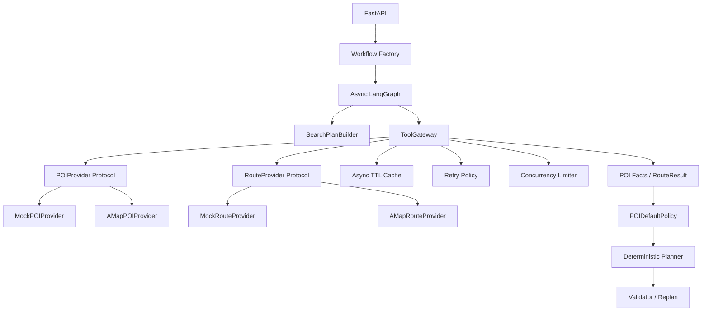
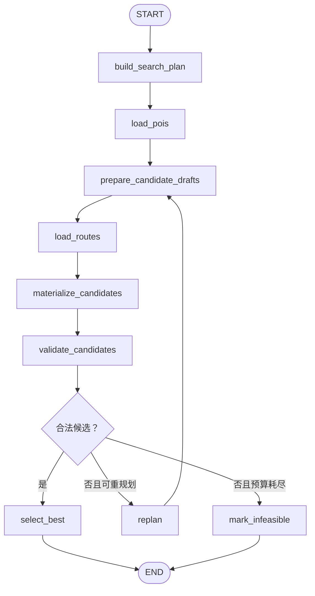

# Travel Agent v0.2 Tool Provider 与可靠性网关设计

- 日期：2026-08-19
- 状态：已完成对话设计确认，等待书面规格复核
- 目标版本：0.2.0
- 基线版本：0.1.0

## 1. 背景

v0.1 已经实现一个确定性的 LangGraph 旅行规划闭环：加载杭州 Mock POI、生成三个候选、检查硬约束、在有限次数内重规划，并通过 FastAPI 返回结果。它证明了 Graph 控制流、Planner、Validator、Checkpoint 和日志链路能够协同工作，但外部世界数据仍是固定 Mock，路线时间也来自本地估算。

v0.2 的单一目标是建立可替换、可测试、可观察的 Tool Provider 层，并完成高德 POI 2.0 与驾车路径规划 2.0 适配器。默认运行模式仍是 Mock；高德模式在配置 Key 后启用。两种模式共享协议但严格隔离，真实模式失败时不得回退到 Mock。

### 1.1 简历项目与 Agent 能力优先级

本项目首先是一个用于简历和面试展示的旅行规划 Agent。v0.2 建设 Provider 和 Tool Gateway 的目的，是把 v0.1 的静态数据调用升级为真实、可靠、可观察的 **Tool Use**，而不是把本版本做成地图 API SDK。

本版本的展示重点按以下顺序排列：

1. Agent 怎样根据旅行需求形成工具查询意图；
2. Graph 怎样进入工具节点并把标准化结果写回 State；
3. 候选生成怎样消费工具结果，而不是依赖 LLM 或本地猜测事实；
4. Validator 怎样产生反馈，Conditional Edge 怎样触发 Select、Replan 或 Stop；
5. 工具超时、重试耗尽和业务无解怎样走不同控制路径；
6. 日志和轨迹测试怎样证明 Tool Use 与 Loop 实际发生。

Provider 字段覆盖、缓存算法和 HTTP 工程只实现支撑上述 Agent 轨迹所需的范围。与 Agent 展示无直接关系的供应商能力不在 v0.2 扩张。

## 2. 目标与非目标

### 2.1 目标

- 让 `Search Intent → Tool Use → State Update → Plan → Validate → Replan` 成为可观察、可测试的 Agent 轨迹。
- 定义与供应商无关的 `POIProvider` 和 `RouteProvider` 异步协议。
- 让 Mock 与高德实现相同协议。
- 使用独立 `SearchPlanBuilder` 生成确定性 POI 检索任务。
- 使用 `ToolGateway` 统一处理缓存、并发限制、重试、错误分类和日志。
- 将高德响应转换为领域模型，不让原始 JSON 进入 Planner 或 Graph State。
- 将 Graph 和 FastAPI 规划接口改为异步执行。
- 使用 Provider 路线结果生成日程中的道路距离和驾车耗时。
- 显式处理高德缺失的营业时间、费用和建议游玩时长。
- 保持 Validator、Replan 和候选选择的确定性与可回归测试性。
- 建立完全离线的 Provider 契约测试。

### 2.2 非目标

v0.2 不实现：

- LLM 自然语言 Requirement Parser；
- LLM Query Planner；
- 天气 Provider；
- 公交、步行、骑行或交通方式选择；
- OR-Tools；
- Redis、数据库或分布式锁；
- MCP Server；
- LangGraph `interrupt/resume`；
- 前端地图；
- 自动抓取景区官网。

## 3. 已确认的设计决策

1. 默认 `TRAVEL_PROVIDER=mock`，不需要任何 API Key。
2. `TRAVEL_PROVIDER=amap` 只使用高德，不允许降级到 Mock。
3. 显式选择高德但缺少 Key 时，应用启动失败。
4. 高德可恢复错误采用有限重试；重试耗尽后 API 返回 HTTP 503。
5. `infeasible` 只表示数据获取成功但约束下无合法行程，不表示工具故障。
6. v0.2 只实现驾车路线，默认使用高德推荐策略 `strategy=32`。
7. POI 检索由确定性规则生成，未来可替换为更智能的 Query Planner。
8. 不构建所有 POI 的完整两两路线矩阵，只查询候选实际使用的路线段。
9. 外部缺失字段不能被静默伪装成 Provider 事实。
10. 缺失事实默认采用 `assume_with_warning`；同时提供 `strict` 策略。
11. Provider 与 Gateway 是 Agent Tool Use 的支撑层；不得让供应商集成细节淹没 Graph Loop、State 变化和决策轨迹。

## 4. 总体架构



### 4.1 边界原则

- Provider 负责一次外部能力调用和响应标准化。
- Gateway 负责跨 Provider 通用的可靠性策略。
- Search Plan 负责决定搜什么，不负责真正请求。
- Planner 负责如何使用事实生成计划，不负责 HTTP、重试或缓存。
- Validator 负责判断计划，不负责补造缺失事实。
- API 负责把领域错误映射成 HTTP 语义，不负责理解高德错误码。

## 5. 模块设计

目标目录结构：

```text
src/travel_agent/
├── config.py
├── api/
│   ├── dependencies.py
│   ├── errors.py
│   └── routes.py
├── domain/
│   ├── models.py
│   └── tool_models.py
├── graph/
│   ├── state.py
│   └── workflow.py
├── planning/
│   ├── defaults.py
│   ├── planner.py
│   ├── search_plan.py
│   └── validator.py
└── tools/
    ├── cache.py
    ├── errors.py
    ├── gateway.py
    ├── protocols.py
    ├── retry.py
    └── providers/
        ├── amap.py
        └── mock.py
```

### 5.1 Settings

`Settings` 负责读取并校验以下环境变量：

```text
TRAVEL_PROVIDER=mock|amap
AMAP_API_KEY=
TOOL_TIMEOUT_SECONDS=5
TOOL_MAX_ATTEMPTS=3
TOOL_BACKOFF_BASE_SECONDS=0.25
TOOL_MAX_BACKOFF_SECONDS=2
TOOL_MAX_CONCURRENCY=5
TOOL_CACHE_MAX_ENTRIES=2048
POI_CACHE_TTL_SECONDS=3600
ROUTE_CACHE_TTL_SECONDS=300
POI_QUERY_LIMIT=10
POI_CANDIDATE_LIMIT=12
UNKNOWN_FACT_POLICY=assume_with_warning|strict
AMAP_DRIVING_STRATEGY=32
```

配置在应用启动时创建一次。高德模式缺少 Key、超时非正数、重试次数小于 1 或不支持的枚举值均属于配置错误，应用不得带病启动。

### 5.2 SearchPlanBuilder

输入为 `TripSpec`，输出去重后的 `POISearchQuery`：

1. `must_visit` 中每个非空名称生成一个精确倾向查询。
2. `interests` 中每个非空兴趣生成一个普通关键词查询。
3. 没有兴趣和必去地点时，生成默认关键词“景点”。
4. 查询保留优先级，必去地点高于兴趣，高于默认词。
5. 每个查询默认最多取 10 条，合并后按 Provider POI ID 去重。
6. 最终候选池默认最多保留 12 个，避免路线请求随结果数量失控。

该模块不调用网络。后续词典扩展、分类码映射、LLM 查询改写或召回评测只替换该模块。

### 5.3 Provider Protocol

```python
class POIProvider(Protocol):
    name: str

    async def search_pois(self, query: POISearchQuery) -> list[POIFacts]: ...


class RouteProvider(Protocol):
    name: str

    async def get_driving_route(self, query: RouteQuery) -> RouteResult: ...
```

Provider 实现一次调用，不自行重试，不决定缓存，也不调用其他 Provider。它可以抛出标准 `ToolProviderError`，但不得泄漏 Key 或完整原始响应。

### 5.4 Mock Provider

- `MockPOIProvider` 包装现有杭州 Mock 数据。
- `MockRouteProvider` 包装现有 Haversine 与道路距离估算。
- Mock 仍只支持仓库中明确提供的数据，不伪造其他城市。
- Mock 方法保持异步签名，以便 Graph 和测试与高德模式使用同一数据流。

### 5.5 AMap Provider

高德适配器使用共享 `httpx.AsyncClient`：

- POI：`GET https://restapi.amap.com/v5/place/text`
- 驾车：`GET https://restapi.amap.com/v5/direction/driving`
- POI 请求使用 `region=<city>`、`city_limit=true` 和受控 `page_size`。
- 需要商业字段时显式设置 `show_fields=business`。
- 驾车请求使用经度在前、纬度在后的坐标格式，默认 `strategy=32`。
- Provider 同时检查 HTTP 状态和高德 `status/info/infocode` 业务状态。
- 响应先通过 Pydantic 传输模型校验，再映射为领域模型。
- `opentime_week` 能解析时按行程星期生成营业窗口；只有 `opentime_today` 时，仅在行程日期等于抓取日期时视为当日事实，否则按未知营业时间处理。
- 原始 JSON 不写日志、不进入 State、不返回 API。

官方接口参考：

- [高德搜索 POI 2.0](https://lbs.amap.com/api/webservice/guide/api-advanced/newpoisearch)
- [高德路径规划 2.0](https://lbs.amap.com/api/webservice/guide/api/newroute)
- [高德 Web 服务错误码](https://lbs.amap.com/api/webservice/guide/tools/info)

### 5.6 ToolGateway

Gateway 暴露与业务用例对应的批量方法：

```python
async def search_pois(
    queries: list[POISearchQuery],
    context: ToolCallContext,
) -> list[ToolResult[list[POIFacts]]]: ...

async def get_routes(
    queries: list[RouteQuery],
    context: ToolCallContext,
) -> dict[RouteKey, ToolResult[RouteResult]]: ...
```

职责包括：

- 生成稳定缓存键；
- 成功缓存与 TTL；
- 每个缓存键的异步锁；
- 全局异步并发限制；
- Retry Policy；
- 统一耗时、尝试次数和缓存命中元数据；
- `tool.*` 日志；
- 批量调用去重并保持结果和请求的可关联性。

Gateway 不包含旅行领域排序、分日或校验逻辑。

## 6. 领域模型

### 6.1 工具查询与结果

```text
ProviderMode
- mock
- amap

RouteMode
- driving

POISearchQuery
- city
- keyword
- exact_match
- limit
- priority

RouteQuery
- origin
- destination
- origin_poi_id
- destination_poi_id
- mode=driving
- strategy

RouteResult
- distance_meters
- duration_minutes
- mode
- provider
- data_confidence
- fetched_at

ToolResult[T]
- status
- data
- provider
- fetched_at
- expires_at
- cache_hit
- attempt_count
- error

ToolError
- category
- code
- operation
- retryable
- safe_message
```

失败可以在 Gateway 内表示为 `ToolResult(status=failed)`；Graph 边界将失败结果转换成类型化 `ToolUnavailableError`，由 API 映射为 503。

### 6.2 事实、假设与规划值

高德不保证返回营业时间和人均消费，也不提供建议游玩时长。模型必须区分事实和规划假设：

```text
POIFacts
- id
- name
- city
- coordinate
- categories
- opening_hours: optional
- average_cost_per_person: optional
- suggested_duration_minutes: optional
- provider
- fetched_at
- field_sources

PlanningPOI
- facts
- effective_opening_window
- effective_party_cost: optional
- effective_duration_minutes
- assumptions
- data_confidence
```

字段来源使用：

```text
provider
derived
default
user_confirmed
```

`POIDefaultPolicy` 是唯一允许生成默认规划值的模块。默认值必须带：

- 字段名；
- 假设值；
- 原因；
- 策略版本；
- 创建时间。

不得在 Provider、Planner 或 Validator 中散落魔法默认值。

### 6.3 缺失事实策略

`assume_with_warning`：

- 使用保守默认值继续规划；
- 产生 `PlanningAssumption`；
- 降低 `data_confidence`；
- Validator 产生数据未验证警告；
- API 在候选中返回假设摘要。

`strict`：

- 缺少必要营业时间或游玩时长的 POI 不进入可调度候选；
- 未知价格不得被当作免费；
- 如果必去地点因关键事实缺失无法安排，返回明确的数据不完整违规。

v0.2 默认使用 `assume_with_warning`，并固定第一版策略：

- 营业时间未知时使用 `10:00–16:00` 的保守日间窗口；
- 建议游玩时长未知时使用 90 分钟；
- 费用未知时保持 `None`，不补成 0，也不生成伪精确金额；
- Provider 返回的人均费用乘以 `TripSpec.travelers` 后形成候选的团队费用；
- 若用户设置总预算且候选中存在未知费用，Validator 产生 `budget_unverified` 警告；
- 指标同时记录已知费用合计和未知费用项目数；
- `strict` 模式下，营业时间或时长未知的 POI 不可调度；设置总预算时，费用未知的候选不能成为硬验证通过的方案。

以上默认值由版本为 `v0.2-default-1` 的策略集中提供，并由测试冻结。它们只是可追踪假设，不是高德事实。

为支持未知费用，现有计划模型同步调整：

```text
PlanItem.estimated_cost
Decimal → Decimal | None

DayPlan / PlanMetrics
- known_estimated_cost
- unknown_cost_item_count
```

已知费用只累加非空值。任何显示层都必须把未知费用显示为“待确认”，不得显示为 0 元。

### 6.4 ValidationStatus

验证结果从单一布尔语义扩展为：

```text
valid
valid_with_warnings
invalid
```

- 硬约束错误产生 `invalid`。
- 只有警告时产生 `valid_with_warnings`，仍可参与选择。
- 没有错误和警告时产生 `valid`。
- 候选排序在其他指标相近时优先数据置信度更高、警告更少的方案。

为保持兼容，`ValidationResult.valid` 保留为派生属性：`status != invalid`。

### 6.5 步行距离

驾车接口不提供步行距离。v0.2 将：

- 把道路距离和驾车耗时标记为 Provider 事实；
- 基于道路距离派生接驳步行估算；
- 在路线或日程模型中标记 `walking_distance_estimated=true`；
- 不声称该数值来自高德；
- 后续接入步行路线 Provider 后替换该派生值。

## 7. LangGraph 数据流



### 7.1 节点职责

`build_search_plan`

- 根据 `TripSpec` 生成确定性检索计划。

`load_pois`

- 通过 Gateway 执行 POI 查询；
- 合并、去重、限制候选数；
- 应用缺失事实策略；
- 工具失败终止本次运行并上抛，不进入 Replan。

`prepare_candidate_drafts`

- 根据兴趣、费用、置信度和当前重规划轮次选择 POI；
- 使用 Haversine 直线距离完成初步顺序，不把它写成真实路线指标；
- 形成分日访问顺序草稿；
- 收集实际需要的路线段。

`load_routes`

- 对路线段生成稳定 `RouteKey` 并去重；
- 通过 Gateway 并发加载；
- 使用缓存复用已有结果；
- 任一必要路线不可用时，按工具失败处理，不用估算器替换高德结果。

`materialize_candidates`

- 使用 `RouteResult` 计算到达、开始和结束时间；
- 生成最终 `DayPlan`、`PlanItem` 和 `PlanMetrics`；
- 携带假设、来源和数据置信度。

`validate_candidates`

- 检查现有硬约束；
- 增加缺失事实和估算字段警告；
- 产生 `ValidationStatus`。

`replan`

- 只调整规划密度和选点；
- 回到草稿节点；
- 新路线按需查询，已有路线走缓存。

### 7.2 State 最小化

State 保存：

- `thread_id` 和 `TripSpec`；
- 检索查询；
- 标准化 `PlanningPOI`；
- 候选草稿；
- 去重路线查询与结果映射；
- 候选计划、迭代次数、状态和消息；
- 精简工具执行摘要。

State 不保存：

- API Key；
- `httpx` Client；
- Provider 实例；
- 高德原始 JSON；
- HTTP Header；
- 完整异常对象。

## 8. 路线调用量控制

完整 N×N 矩阵会快速消耗配额，因此 v0.2 使用两阶段规划：

1. 用坐标直线距离完成候选顺序草稿。
2. 只对三个候选中真实出现的相邻路线段查询 Provider。

同时使用：

- POI 候选池上限；
- 路线段去重；
- 并发信号量；
- 路线 TTL Cache；
- Replan 缓存复用。

该设计不保证路线顺序全局最优。v0.2 的目标是可靠工具接入；基于真实路线矩阵和 OR-Tools 的优化留到后续版本。

## 9. 缓存设计

### 9.1 规则

- 只缓存成功结果。
- POI 默认 TTL 为 3600 秒。
- 驾车路线默认 TTL 为 300 秒。
- 缓存重启后清空。
- 缓存默认最多 2048 条，超限时淘汰最早过期或最旧条目。
- 同一 Key 使用异步锁避免缓存击穿。

### 9.2 缓存键

POI Key 包含：

```text
provider + city + normalized_keyword + exact_match + limit
```

Route Key 包含：

```text
provider + rounded_origin + rounded_destination + mode + strategy
```

Key 中不得包含 API Key。坐标保留不超过高德支持的 6 位小数。

## 10. 重试与错误分类

### 10.1 默认策略

- 总尝试次数：3；
- 退避：指数退避；
- 基础等待：0.25 秒；
- 最大单次等待：2 秒；
- 增加随机 jitter；
- Provider 响应有可接受的 `Retry-After` 时优先遵守；
- 测试通过注入 sleeper 和 jitter source，不真实等待。

### 10.2 可重试

- 连接失败；
- 建连、读取或总超时；
- HTTP 429、502、503、504；
- 高德短期限流或 QPS 限制：`10004`、`10019`、`10020`、`10021`；
- 高德网关超时：`10015`；
- 高德服务器繁忙或临时资源不可用：`10016`、`10017`。

### 10.3 不可重试

- Key 无效或过期：`10001`；
- 权限不足、平台类型不匹配、IP 白名单错误；
- 请求参数错误；
- 每日配额耗尽：`10003`；
- 响应 Schema 永久不兼容；
- 业务明确返回无结果。

“无搜索结果”是成功的空数据，不是网络错误。规划层根据必去地点和候选数量决定返回数据不足还是无可行计划。

## 11. API 错误语义

工具失败不得返回 `PlanningResponse(status=infeasible)`。API 返回：

```http
HTTP/1.1 503 Service Unavailable
Content-Type: application/json; charset=utf-8
```

```json
{
  "detail": {
    "code": "tool_unavailable",
    "provider": "amap",
    "operation": "search_pois",
    "category": "timeout",
    "retryable": true,
    "thread_id": "run-id",
    "message": "地图服务暂时不可用，请稍后重试"
  }
}
```

客户端响应不包含：

- API Key；
- 请求完整 URL；
- 上游原始响应；
- 内部堆栈；
- 可能包含凭据的 Header。

配置错误在启动时失败，不映射成运行期 503。

## 12. 异步生命周期与依赖注入

- FastAPI `lifespan` 创建一个共享 `httpx.AsyncClient`。
- 根据 `Settings` 只创建选定模式的 Provider。
- 创建共享 Gateway、TTL Cache 和编译后的 Workflow。
- 应用关闭时关闭 HTTP Client。
- API 路由使用 `async def` 并调用 `workflow.ainvoke()`。
- `build_workflow(gateway, policies)` 替代硬编码全局 Mock 依赖。
- 测试直接注入 Fake/Mock Provider、Fake Clock 和 Fake Sleeper。

保留一个明确标记为同步便利入口的兼容层仅在确有调用方需要时实现；核心执行路径只维护异步版本，避免在事件循环中嵌套 `asyncio.run()`。

## 13. 可观测性

新增事件：

```text
tool.started
tool.cache_hit
tool.retry_scheduled
tool.completed
tool.failed
```

字段包括：

```text
thread_id
provider
operation
attempt
cache_hit
result_count
elapsed_ms
error_category
retryable
```

日志不得包含 Key、完整 URL 查询串、原始响应或完整用户地址。POI 和路线调用的参数只记录数量、城市和脱敏摘要。

原有 `planning.*`、`node.*`、`candidate.*` 和 `routing.decision` 日志继续保留。

## 14. 测试策略

### 14.1 单元测试

- 配置解析和高德 Key 启动校验；
- Search Plan 优先级、默认词与去重；
- 默认值策略与 `strict` 策略；
- 字段来源、假设与置信度；
- 缓存命中、过期、容量和并发防击穿；
- Retry Policy 的次数、退避和分类；
- 路线 Key 与请求去重；
- Planner 使用 Provider 路线结果；
- ValidationStatus 和数据未验证警告。

### 14.2 高德契约测试

使用仓库内脱敏 Fixture 和 `httpx.MockTransport`，不访问真实网络：

- POI 正常结果；
- 空结果；
- 缺少 business 字段；
- 缺少或错误坐标；
- 驾车路线正常结果；
- 无路线；
- 错误响应结构；
- Key 无效；
- 权限错误；
- 临时限流；
- 每日配额耗尽；
- 服务器繁忙；
- HTTP 429/5xx；
- 超时与连接异常。

### 14.3 Gateway 集成测试

- 第一次调用进入 Provider，第二次命中缓存；
- 相同并发请求只触发一次 Provider 调用；
- 可恢复错误重试后成功；
- 不可恢复错误只调用一次；
- 失败结果不缓存；
- 高德模式失败时 Mock Provider 调用次数始终为零；
- 日志和错误中不出现测试 Key。

### 14.4 Graph 与 API 测试

- 默认 Mock 模式完成规划；
- Replan 与 `infeasible` 行为保持；
- 异步 Graph 从 START 到 END；
- 路线事实进入日程指标；
- 数据假设产生 `valid_with_warnings`；
- 工具失败返回 503；
- 业务无解仍返回正常 `PlanningResponse`；
- UTF-8 JSON 行为保持。

除最终响应断言外，Graph 测试必须断言关键轨迹：工具节点被调用、工具结果写回 State、Validation 反馈产生、条件边选择正确，以及 Replan 只在满足条件时发生。

### 14.5 可选真实冒烟测试

- 默认跳过；
- 仅在显式环境变量和 Key 同时存在时运行；
- 不进入普通测试或 CI；
- 只执行最小 POI 与路线请求；
- 不断言随时间变化的精确路线值，只断言 Schema、正数距离/耗时和 Provider 标识。

### 14.6 质量门槛

- 全部普通测试离线运行；
- v0.1 行为有回归保护；
- 总分支覆盖率不低于 90%；
- `pip check` 无依赖冲突；
- 源码和测试通过编译检查；
- 文档配置示例不包含真实 Key。

## 15. 依赖变化

```text
运行依赖：
httpx

开发依赖：
pytest-asyncio
```

`httpx` 从仅测试用途升级为运行时 HTTP Client。除这些依赖外，v0.2 不引入重型可靠性或缓存框架。

## 16. 文档交付

```text
docs/v0.2/
├── README.md
├── 01-architecture.md
├── 02-provider-contracts.md
├── 03-tool-gateway-reliability.md
├── 04-async-langgraph-flow.md
├── 05-running-and-testing.md
└── 06-learning-guide.md
```

根 README 更新版本、架构、环境变量、Mock 启动方式和高德模式说明。`.env.example` 增加所有非敏感默认配置，Key 保持空值。

## 17. 后续演进

### 17.1 检索优化

按以下顺序演进：

```text
直接兴趣词
→ 同义词与高德分类码映射
→ 查询改写与多查询召回
→ 基于历史评测的查询排序
→ LLM Query Planner
```

Provider 协议保持不变。

### 17.2 POI 事实完善

1. 对 Top-N 调用高德 POI 详情补全，而不是补全全部搜索结果。
2. 将单窗口升级为按星期和特殊日期表达的营业日历。
3. 接入景区、博物馆等官方数据源并保留来源优先级。
4. 使用 LangGraph `interrupt/resume` 让用户确认未知关键事实。
5. 临近出发前刷新营业、关闭、天气和交通事实，并只重规划受影响日期。

### 17.3 路线完善

```text
驾车单模式
→ 步行与公交 Provider
→ 用户交通偏好
→ 批量路线矩阵
→ OR-Tools 时间窗优化
```

## 18. 实施顺序约束

后续实施计划应遵循：

1. 先用测试冻结 v0.1 行为。
2. 先定义领域模型和 Provider Contract，再实现适配器。
3. 先完成 Mock Provider 迁移，再接高德。
4. 先测试错误分类，再实现 Retry Policy。
5. 先让异步 Gateway 独立通过测试，再接入 Graph。
6. 最后更新 API、文档和真实冒烟入口。

所有行为变更使用测试驱动开发；不得通过实时网络测试替代离线契约测试。

## 19. 验收标准

v0.2 完成必须同时满足：

- Mock 和高德实现同一异步 Protocol。
- 默认 Mock 模式无 Key 可运行。
- 高德模式缺 Key 启动失败。
- 高德模式运行时绝不调用 Mock。
- POI 和路线原始响应不进入 Planner 或 State。
- 高德请求具备超时、有限重试、并发限制和 TTL Cache。
- 错误分类区分可恢复与不可恢复错误。
- 重试耗尽返回 HTTP 503。
- `infeasible` 只表达业务不可行。
- Planner 的道路距离和驾车耗时来自当前 Provider。
- 估算步行距离和缺失 POI 字段具有显式来源与警告。
- `assume_with_warning` 与 `strict` 均有测试。
- Tool Use、State 更新、条件路由和 Replan Loop 具有轨迹级测试与可观察日志。
- API Key 不出现在日志、异常或响应。
- 所有普通测试离线通过，覆盖率不低于 90%。
- v0.2 学习文档完整且与代码一致。

## 20. 风险与控制

| 风险 | 控制措施 |
|---|---|
| 高德字段缺失或类型不稳定 | Pydantic 传输模型、Fixture 契约测试、显式未知值 |
| 默认营业时间导致错误可行性 | 保守假设、来源标记、警告、strict 模式、降低置信度 |
| 路线请求数量过多 | 候选上限、草稿两阶段、路线去重、缓存、并发限制 |
| 重试放大限流 | 只重试可恢复错误、指数退避、jitter、最大次数 |
| Mock 污染真实结果 | 启动时单一 Provider 选择、无 fallback 分支、隔离测试 |
| API Key 泄漏 | 参数脱敏、禁止完整 URL/响应日志、专门安全测试 |
| 异步改造破坏 v0.1 | Workflow Factory、Mock 先迁移、端到端回归测试 |
| 实时路况导致测试不稳定 | 普通测试全部使用固定 Fixture，真实冒烟测试默认跳过 |
