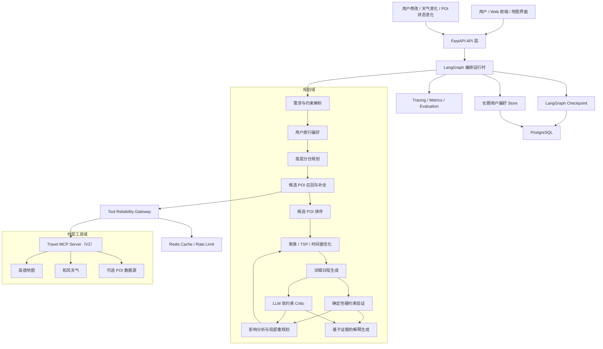
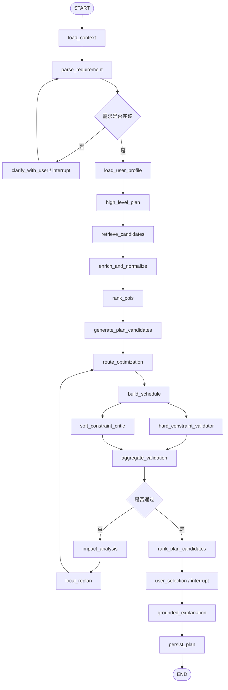

# 中国城市约束感知自适应旅行规划 Agent

> Constraint-Aware Adaptive Travel Planning System

- 文档版本：1.0
- 更新日期：2026-08-17
- 文档用途：项目架构设计、模块拆分、开发实施与项目评测指导
- 项目定位：面向中国城市旅行场景的长期运行、可验证、可重规划 Agent 系统

## 目录

1. [项目概述](#1-项目概述)
2. [设计原则](#2-设计原则)
3. [总体系统架构](#3-总体系统架构)
4. [核心业务流程](#4-核心业务流程)
5. [LangGraph 工作流设计](#5-langgraph-工作流设计)
6. [核心领域模型](#6-核心领域模型)
7. [项目模块设计](#7-项目模块设计)
8. [约束、优化与候选方案](#8-约束优化与候选方案)
9. [局部重规划与事件驱动](#9-局部重规划与事件驱动)
10. [工具接入与可靠性](#10-工具接入与可靠性)
11. [状态、记忆与持久化](#11-状态记忆与持久化)
12. [MCP 设计](#12-mcp-设计)
13. [后端 API 设计](#13-后端-api-设计)
14. [数据存储设计](#14-数据存储设计)
15. [可观测性与评测体系](#15-可观测性与评测体系)
16. [安全、隐私与数据可信](#16-安全隐私与数据可信)
17. [技术栈与目录结构](#17-技术栈与目录结构)
18. [项目实施路线](#18-项目实施路线)
19. [测试策略](#19-测试策略)
20. [验收标准](#20-验收标准)
21. [项目知识点](#21-项目知识点)
22. [项目展示与面试表达](#22-项目展示与面试表达)
23. [参考资料](#23-参考资料)

---

## 1. 项目概述

### 1.1 项目定义

本项目是一个面向中国城市旅行场景的约束感知自适应规划系统。系统接收用户的自然语言旅行需求，调用地图、天气等真实数据工具，生成多个候选行程，通过确定性约束检查和路线优化确保行程可执行，并在用户修改或外部环境变化后进行局部重规划。

项目不是普通攻略生成器，也不是简单的“LLM 调用地图 API”示例。它重点展示以下能力：

- 复杂自然语言需求的结构化理解
- 分层规划与多候选方案生成
- 真实地理、路线和天气数据接入
- 确定性约束检查与运筹优化
- LangGraph 状态、分支、循环、暂停和恢复
- 用户编辑与环境事件触发的局部重规划
- 长期用户偏好学习
- 工具调用可靠性和故障降级
- 基于 Benchmark 的量化评测

### 1.2 典型用户输入

```text
10 月 2 日到 10 月 5 日去杭州，两个人，预算 5000 元，
住西湖附近，喜欢自然和美食，带父母，不想太累。
2 日 11:00 到杭州东站，5 日 18:00 从杭州东站离开。
灵隐寺必须去，不想安排太多博物馆。
```

### 1.3 系统输出

系统输出的不只是一篇自然语言攻略，而是一套结构化、可执行、可修改的计划：

- 每日主题与主要活动区域
- 具体 POI、餐厅、休息点和活动顺序
- 到达、游玩、交通、用餐和离开时间
- 地点之间的真实交通时间与距离
- 每日和总预算估算
- 营业时间、天气、体力和节奏检查结果
- Relaxed、Balanced、Exploration 等候选方案
- 各方案的量化评分、风险与推荐理由
- 数据来源、获取时间和置信度
- 用户后续编辑、锁定与局部重规划能力

### 1.4 项目边界

V1 不依赖以下能力：

- 实时机票库存和价格
- 实时酒店库存和价格
- 机票、酒店、门票下单
- 支付、退款与 OTA 交易闭环

交通和住宿条件作为规划输入：

```text
到达时间 + 到达地点
离开时间 + 离开地点
住宿地址或住宿区域
```

如果用户还没有确定住宿，系统可以推荐住宿区域，但不承诺实时房型、库存或成交价。

### 1.5 项目价值

项目的核心价值不是接入了多少 API 或创建了多少 Agent，而是回答以下工程问题：

```text
复杂需求如何转化为可验证的结构化约束？
哪些任务由 LLM 完成，哪些任务必须由算法或代码完成？
怎样证明生成的行程在时间、距离和预算上可执行？
环境变化后如何只修改受影响部分？
外部工具超时、限流或返回空数据时系统如何继续工作？
怎样通过 Benchmark 证明系统优于 LLM 直接生成？
```

---

## 2. 设计原则

### 2.1 职责分离

```text
LLM
负责：需求理解、高层规划、语义匹配、软约束判断、自然语言解释

算法
负责：地理聚类、路线优化、时间窗调度、候选方案搜索

确定性代码
负责：时间、预算、距离、营业时间、必去地点等硬约束

LangGraph
负责：状态、节点编排、条件路由、循环、暂停恢复和 Checkpoint

工具网关
负责：外部数据、缓存、超时、重试、限流、降级和数据溯源
```

### 2.2 合法性优先于文案质量

只有硬约束全部通过的候选计划才可以成为最终可交付计划。文案表达再自然，也不能掩盖时间冲突、超预算或营业时间错误。

如果不存在合法解，系统应返回不可行原因，并建议用户放宽哪些约束，而不是让 LLM 强行生成一个看似合理的方案。

### 2.3 数据可追溯

所有关键事实都应携带：

- 数据来源
- 数据获取时间
- 过期时间
- 数据置信度
- 是否使用缓存
- 是否使用降级结果

### 2.4 状态最小化与强类型

领域数据使用 Pydantic、dataclass 或 TypedDict 定义，不把全部内容塞入对话 `messages`。Graph State 保存执行所需的最小结构化状态，大型原始数据存储在数据库或缓存中，State 中保留 ID 或摘要。

### 2.5 有界执行

所有 Planner、Critic 和 Replanner 循环都必须有：

- 最大迭代次数
- 最大 LLM 调用数
- 最大工具调用数
- 总执行时限
- 最小质量提升阈值
- 明确的不可行状态

### 2.6 增量修改

用户只修改 Day 2 时，不应重新生成 Day 1 到 Day 4。系统必须识别受影响范围，冻结未受影响内容，并生成可审计的版本差异。

---

## 3. 总体系统架构



### 3.1 分层说明

| 层级 | 主要职责 |
|---|---|
| 前端层 | 需求输入、地图展示、执行进度、方案对比、行程编辑 |
| API 层 | 用户、旅行、运行、版本、事件、审批和恢复接口 |
| LangGraph 层 | 状态、节点、路由、循环、Checkpoint、HITL |
| Agent 层 | 需求理解、高层规划、软约束评价、自然语言解释 |
| 领域服务层 | POI 排序、日程构建、约束验证、局部重规划 |
| 算法层 | 地理聚类、TSP、时间窗、多目标评分、候选搜索 |
| 工具层 | 地图、天气、搜索、缓存、重试、降级 |
| 数据层 | 用户、旅行、计划版本、Checkpoint、偏好和缓存 |
| 评测层 | Benchmark、回归测试、轨迹评测、成本与延迟分析 |

---

## 4. 核心业务流程

### 4.1 新建旅行计划

1. 用户输入自然语言需求。
2. Requirement Parser 生成结构化 `TripSpec`。
3. 代码检查日期、时间、预算和字段完整性。
4. 信息不足时，通过 `interrupt` 暂停并向用户询问。
5. 加载长期用户偏好，生成高层分日骨架。
6. 根据每日主题和区域召回候选 POI。
7. 标准化 POI，并补充坐标、营业时间、费用和属性。
8. 计算候选地点之间的真实交通时间矩阵。
9. 生成多种风格的候选计划。
10. 使用算法进行分日、排序和时间窗调度。
11. 硬约束 Validator 与 LLM Critic 并行检查。
12. 不合格时进入局部修复循环。
13. 合格后综合排序，等待用户选择或编辑。
14. 生成基于真实元数据的推荐解释。
15. 保存最终计划、版本、指标和 Checkpoint。

### 4.2 用户编辑计划

示例：

```text
Day 2 不想去博物馆，其他天不要动。
```

处理流程：

```text
读取当前计划版本
  ↓
Change Detector 解析修改意图
  ↓
affected_days = {2}
locked_days = {1, 3, 4}
  ↓
失效 Day 2 的路线、日程和评分
  ↓
复用仍然有效的候选和缓存
  ↓
只重规划 Day 2
  ↓
验证 Day 2 局部约束和全局预算
  ↓
创建 Plan Version 2 和版本 Diff
```

### 4.3 外部事件触发

```text
天气变化 / POI 临时关闭 / 交通显著变化
  ↓
Event Normalizer
  ↓
Impact Analyzer
  ↓
识别受影响日期、地点、路线和时间段
  ↓
冻结未受影响内容
  ↓
局部替换、重排或时间调整
  ↓
重新验证并生成新版本
```

V1 可以通过用户主动刷新或内部模拟事件触发。持续监控和定时事件属于后续能力，不应阻塞核心规划闭环。

---

## 5. LangGraph 工作流设计

### 5.1 主图



### 5.2 节点职责

| 节点 | 类型 | 输入 | 输出 |
|---|---|---|---|
| `load_context` | 代码 | trip/user/thread ID | 当前旅行、版本和执行上下文 |
| `parse_requirement` | LLM + 代码 | 用户需求 | `TripSpec`、缺失字段、解析置信度 |
| `clarify_with_user` | HITL | 缺失字段 | 用户补充信息 |
| `load_user_profile` | 代码 | user ID | 结构化长期偏好 |
| `high_level_plan` | LLM | TripSpec、偏好 | 每日主题、区域、强度和预算骨架 |
| `retrieve_candidates` | 工具/代码 | 检索计划 | 原始 POI 候选 |
| `enrich_and_normalize` | 工具/代码 | 原始 POI | 标准化、去重、补全的 POI |
| `rank_pois` | 代码 + 可选 LLM | POI、偏好 | Top-N 候选和特征分数 |
| `generate_plan_candidates` | LLM/搜索 | 高层计划、候选 | 多风格候选计划 |
| `route_optimization` | 算法 | 候选、时间矩阵 | 分日和访问顺序 |
| `build_schedule` | 代码 | 优化结果 | 带时间戳的详细日程 |
| `hard_constraint_validator` | 代码 | TripSpec、日程 | 硬约束违规列表 |
| `soft_constraint_critic` | LLM | 日程、偏好 | 软约束评价和修复建议 |
| `impact_analysis` | 代码 + 可选 LLM | 违规或变更 | 影响范围和失效依赖 |
| `local_replan` | LLM + 算法 | 影响范围 | 局部修改后的候选 |
| `rank_plan_candidates` | 代码 | 合法候选和指标 | 候选排名 |
| `user_selection` | HITL | 候选摘要 | 用户选择、锁定或编辑 |
| `grounded_explanation` | LLM | 结构化事实 | 不新增事实的自然语言说明 |
| `persist_plan` | 代码 | 最终计划 | 版本、指标、审计记录 |

### 5.3 子图建议

可以将以下部分拆成 LangGraph Subgraph：

- `requirement_subgraph`：解析、校验、补充信息
- `retrieval_subgraph`：POI 召回、补全、去重、工具降级
- `planning_subgraph`：候选生成、优化、日程构建
- `validation_subgraph`：硬约束、软约束、聚合和修复
- `replanning_subgraph`：变更解析、影响分析、局部重规划

不要为了“多 Agent”而强行把所有函数拆成独立 Agent。只有需要模型推理、独立上下文或复杂决策的职责才使用 Agent/Subgraph。

### 5.4 执行预算

建议初始默认值：

```python
ExecutionBudget(
    max_llm_calls=8,
    max_replan_rounds=3,
    max_candidate_plans=3,
    max_tool_calls=40,
    deadline_seconds=90,
    min_score_improvement=0.02,
)
```

停止条件：

- 所有硬约束通过
- 达到最大修复轮数
- 连续两轮质量提升小于阈值
- LLM、工具调用或时间预算耗尽
- 求解器确认无可行解
- 用户主动取消

---

## 6. 核心领域模型

### 6.1 TripSpec

```python
class TripSpec:
    destination: str
    start_date: date
    end_date: date
    travelers: list[Traveler]
    arrival: TransportAnchor
    departure: TransportAnchor
    accommodation: LocationAnchor | None
    total_budget: Decimal | None
    interests: list[str]
    avoid: list[str]
    must_visit: list[str]
    pace: Literal["relaxed", "balanced", "intensive"]
    mobility_constraints: MobilityConstraints
    daily_time_windows: dict[date, TimeWindow]
    hard_constraints: list[Constraint]
    soft_preferences: list[Preference]
```

### 6.2 POI

```python
class POI:
    id: str
    source: str
    source_id: str
    name: str
    coordinate: Coordinate
    address: str | None
    categories: list[str]
    opening_hours: list[OpeningWindow]
    estimated_duration_min: int
    estimated_cost: Decimal | None
    indoor_outdoor: Literal["indoor", "outdoor", "mixed", "unknown"]
    suitability_tags: list[str]
    data_confidence: float
    fetched_at: datetime
    expires_at: datetime | None
```

### 6.3 PlanCandidate

```python
class PlanCandidate:
    id: str
    style: Literal["relaxed", "balanced", "exploration"]
    days: list[DayPlan]
    metrics: PlanMetrics
    validation: ValidationResult
    score: float | None
    reason_facts: list[ReasonFact]
```

### 6.4 DayPlan 与 PlanItem

```python
class DayPlan:
    date: date
    theme: str
    primary_area: str
    items: list[PlanItem]
    estimated_cost: Decimal
    total_travel_minutes: int
    walking_distance_meters: int
    fatigue_score: float


class PlanItem:
    type: Literal["activity", "meal", "rest", "transport"]
    poi_id: str | None
    start_at: datetime
    end_at: datetime
    travel_from_previous_min: int
    estimated_cost: Decimal
    locked: bool
```

### 6.5 Violation

```python
class Violation:
    type: str
    severity: Literal["error", "warning"]
    day: int | None
    entity_ids: list[str]
    expected: str
    actual: str
    repair_hint: str
```

### 6.6 ToolResult

```python
class ToolResult[T]:
    success: bool
    data: T | None
    provider: str
    fetched_at: datetime
    expires_at: datetime | None
    confidence: float
    cache_hit: bool
    fallback_used: bool
    error: ToolError | None
```

### 6.7 Graph State

```python
class TravelState(TypedDict):
    request_id: str
    user_id: str
    trip_id: str

    trip_spec: TripSpec
    missing_fields: list[str]
    user_profile: UserTravelProfile

    high_level_plan: HighLevelPlan
    poi_candidates: list[POI]
    travel_time_matrix_ref: str | None

    plan_candidates: list[PlanCandidate]
    selected_plan_id: str | None

    hard_validation: ValidationResult
    soft_critique: CritiqueResult

    affected_days: set[int]
    locked_days: set[int]
    locked_items: set[str]

    revision: int
    revision_history: list[PlanRevision]

    execution_budget: ExecutionBudget
    tool_errors: list[ToolError]
    degraded_capabilities: list[str]
    status: str
```

大型路线矩阵不应直接长期放入 State，可以存入 Redis/PostgreSQL，并在 State 中保存引用和版本哈希。

---

## 7. 项目模块设计

### 7.1 Requirement Parser

职责：将自然语言需求转换成结构化 `TripSpec`。

需要识别：

- 城市和日期
- 人数、年龄和同行关系
- 到达/离开时间与地点
- 住宿地址或住宿区域
- 总预算和每日预算
- 兴趣、排斥项和必去地点
- 行程节奏和出行方式
- 步行、体力和无障碍限制
- 每日可用时间
- 显式硬约束和软偏好
- 缺失信息、冲突信息和歧义

解析完成后由代码执行交叉校验：

- 离开时间是否晚于到达时间
- 日期和时间窗是否有效
- 预算是否为正数
- 每日可用时间是否合理
- 必去地点是否存在明显城市冲突
- 用户是否给出了互相矛盾的要求

### 7.2 Preference Memory

长期记忆是结构化旅行画像，而不是简单保存全部聊天记录：

```json
{
  "pace": "relaxed",
  "preferred_categories": ["人文", "美食", "自然"],
  "avoid": ["长时间排队", "过早起床", "连续爬山"],
  "walking_tolerance_km": 6,
  "preferred_transport": ["地铁", "打车"],
  "food_preferences": ["川菜", "本地小吃"],
  "learned_signals": {
    "museum": -0.3,
    "night_market": 0.7
  }
}
```

偏好更新来源和置信度：

| 来源 | 置信度 |
|---|---:|
| 用户明确表达 | 高 |
| 用户多次删除或选择同类地点 | 中 |
| 单次隐式操作 | 低 |
| 模型自行推断 | 不直接持久化 |

### 7.3 High-level Planner

High-level Planner 只生成旅行骨架，不直接生成精确时刻表。

示例输出：

```text
Day 1：到达 + 西湖东侧轻松活动
Day 2：灵隐寺和西湖西侧，自然与人文主题
Day 3：西溪湿地 + 本地美食主题
Day 4：市区轻量活动 + 返程
```

输出字段：

- 每日主题
- 每日主要区域
- 推荐 POI 类别
- 活动强度
- 室内/室外比例
- 每日预算分配
- 到达和返程缓冲时间
- 需要避免的时间段

### 7.4 POI Retriever

职责：

1. 根据每日主题和区域生成检索计划。
2. 从地图 Provider 召回候选地点。
3. 合并关键字搜索、周边搜索和分类搜索结果。
4. 对用户必去地点执行高优先级精确检索。
5. 记录原始 Provider 数据和请求信息。

### 7.5 POI Enricher 与 Normalizer

职责：

- 去重和实体对齐
- 坐标系统一
- 类别标准化
- 营业时间标准化
- 费用和建议游玩时长补充
- 室内/室外属性判断
- 适老、适童、无障碍等标签补充
- 数据新鲜度与置信度计算

营业时间或费用缺失时必须保留 `unknown`，不能由 LLM 编造。

### 7.6 Candidate Ranker

先使用确定性特征粗排，再对 Top-N 候选进行可选的 LLM 语义重排。

```text
poi_score =
    0.30 × preference_match
  + 0.20 × theme_match
  + 0.15 × geographic_fit
  + 0.10 × weather_fit
  + 0.10 × accessibility
  + 0.10 × data_confidence
  + 0.05 × diversity_gain
```

实际权重应经过 Benchmark 调整，并支持根据用户类型动态变化。

### 7.7 Optimization Engine

处理流程：

```text
候选 POI
  ↓
地理聚类
  ↓
POI 分配到不同日期
  ↓
每天访问顺序优化
  ↓
根据时间窗生成具体日程
```

实现层级：

```text
V1：地理聚类 + 贪心排序
V2：TSP + 营业时间修复
V3：OR-Tools Time Windows + 多目标优化
```

### 7.8 Schedule Generator

将优化结果转换成完整时间表，需要考虑：

- 到达和返程缓冲
- POI 建议游玩时长
- 地点间交通时间
- 排队和等待缓冲
- 午餐、晚餐和休息时间
- 营业时间
- 日落、天气等特殊条件

### 7.9 Hard Constraint Validator

只做确定性检查，不调用 LLM 判断数学或逻辑约束。

### 7.10 Soft Constraint Critic

主要检查：

- 用户说“不赶”，但活动数量是否仍过多
- 兴趣分布是否失衡
- 老人同行是否安排连续高强度活动
- 是否频繁跨区域
- 是否缺少休息和正常用餐
- 活动内容是否过于重复

### 7.11 Grounded Explanation

解释所使用的事实先由系统生成：

```json
{
  "reason_facts": [
    {"type": "travel_time_reduction", "value": "31 分钟"},
    {"type": "preference_match", "value": 0.88},
    {"type": "weather", "value": "下午降雨概率较低"},
    {"type": "constraint", "value": "每日步行低于 6 公里"}
  ]
}
```

LLM 只负责把这些事实转换成自然语言，不允许新增未经验证的事实。

---

## 8. 约束、优化与候选方案

### 8.1 硬约束

不满足硬约束的计划不得直接发布：

```text
活动开始时间 >= 到达时间 + 到达缓冲
返程出发时间 <= 离开时间 - 返程缓冲
访问时间必须位于营业时间内
上一地点结束 + 交通时间 <= 下一地点开始
总预算 <= 用户预算
每日步行距离 <= 用户上限
连续步行时间 <= 用户上限
所有 must_visit 必须被安排
用户锁定内容不得被重规划修改
```

部分约束可以存在 `warning` 和 `error` 两种严重性。例如营业时间数据缺失属于风险警告，已知营业时间冲突属于错误。

### 8.2 软约束

- 行程节奏
- 兴趣匹配
- 内容多样性
- 休息合理性
- 区域连贯性
- 适老、适童体验
- 室内/室外平衡
- 预算使用体验
- 排队和拥挤风险

### 8.3 多候选方案

建议生成三种语义明确的候选，而不是只用随机种子生成三份相似计划：

| 方案 | 目标 |
|---|---|
| Relaxed | 活动少、休息多、交通少、体力压力低 |
| Balanced | 兴趣、效率、预算和体力综合平衡 |
| Exploration | 覆盖更多特色地点，接受更高行程密度 |

### 8.4 综合评分

```text
PlanScore =
    w1 × preference_match
  + w2 × diversity
  + w3 × weather_suitability
  + w4 × data_confidence
  - w5 × normalized_travel_time
  - w6 × walking_load
  - w7 × fatigue
  - w8 × budget_risk
  - hard_violation_penalty
```

所有分项应归一化到相同范围。硬约束违规使用门控更合适：存在 `error` 时直接排除，而不是只扣少量分数。

带父母时应提高 `walking_load`、`fatigue` 和休息间隔权重；预算敏感用户应提高 `budget_risk` 权重。

### 8.5 求解失败

如果没有可行解，系统返回：

- 哪些约束冲突
- 哪些地点无法同时安排
- 至少需要增加多少时间或预算
- 建议删除或移动哪个活动
- 哪些软约束可以放宽

随后通过 HITL 等待用户决定，而不是无限 Replan。

---

## 9. 局部重规划与事件驱动

### 9.1 ChangeEvent

```python
class ChangeEvent:
    type: Literal[
        "add_poi",
        "remove_poi",
        "replace_poi",
        "change_time",
        "change_budget",
        "weather_update",
        "poi_closed",
    ]
    target_id: str | None
    day: int | None
    payload: dict
```

### 9.2 ImpactResult

```python
class ImpactResult:
    affected_days: set[int]
    affected_pois: set[str]
    invalidated_artifacts: set[str]
    preserved_days: set[int]
    requires_global_validation: bool
```

### 9.3 依赖失效规则

| 变更 | 需要失效的结果 |
|---|---|
| 删除某 POI | 当日访问顺序、路线矩阵子集、日程、评分 |
| 修改住宿地 | 所有日期首尾路线、日程和交通指标 |
| 修改总预算 | 全局预算验证和候选排名 |
| 天气变化 | 相关时间段室外活动、天气评分 |
| 修改到达时间 | Day 1 日程和相关路线 |
| 修改离开时间 | 最后一天日程和返程缓冲 |

### 9.4 局部重规划原则

- 未受影响日期保持不变
- 用户锁定项保持不变
- 尽量复用原候选和缓存
- 只重新获取缺失的路线矩阵子集
- 保存修改前后 Diff
- 局部修复后重新检查全局预算和跨日约束

### 9.5 重规划局部性指标

```text
Replanning Locality =
未受影响且保持不变的计划项数量
÷
理论上不需要修改的计划项数量
```

该指标应进入 Benchmark，用来证明系统没有无意义地全量重写计划。

---

## 10. 工具接入与可靠性

### 10.1 V1 工具集合

```text
search_poi
get_poi_detail
geocode
reverse_geocode
get_route
get_travel_time_matrix
get_weather
get_weather_warning
```

### 10.2 Tool Reliability Gateway

```text
Planning Service
  ↓
Tool Gateway
  ├── 参数和 Schema 校验
  ├── Timeout
  ├── Retry + Exponential Backoff + Jitter
  ├── Rate Limit
  ├── Cache
  ├── Circuit Breaker
  ├── Provider Fallback
  ├── Data Provenance
  └── Metrics / Trace
```

### 10.3 缓存策略

| 数据 | 建议缓存策略 |
|---|---|
| POI 基础信息 | 较长 TTL，按 Provider ID 失效 |
| 地理编码 | 长 TTL |
| 路线和时间矩阵 | 中短 TTL，包含交通方式和时间段 |
| 实时天气 | 短 TTL |
| 天气预报 | 根据预报日期动态 TTL |
| 用户计划结果 | 版本化持久化，不作为普通缓存 |

缓存 Key 必须包含：

- Provider
- 坐标或 POI ID
- 交通方式
- 出发时间段
- API 版本
- 影响结果的请求参数

### 10.4 降级原则

```text
路线接口失败
→ 读取可接受时间范围内的缓存
→ 尝试备用 Provider
→ 使用距离估算并明确标记低置信度

天气接口失败
→ 继续生成计划
→ 跳过天气优化
→ 标记天气能力不可用

关键地点数据无法确认
→ 将计划标记为需要人工确认
→ 不伪造营业时间或费用

关键数据全部不可用
→ 返回无法可靠规划
```

### 10.5 幂等性

所有外部写操作和可能在恢复时重新执行的任务都必须设计为幂等：

- 使用 `request_id` 或 `idempotency_key`
- 数据库使用唯一约束
- 计划版本创建避免重复提交
- 中断前不执行无法重复的副作用
- 工具调用尽量封装成可 Checkpoint 的独立任务

---

## 11. 状态、记忆与持久化

### 11.1 三类状态

| 类型 | 生命周期 | 示例 |
|---|---|---|
| Graph State | 单次旅行运行/线程 | TripSpec、候选、违规、当前轮次 |
| Checkpoint | 跨请求恢复 | 当前节点、State Snapshot、待处理任务 |
| Long-term Memory | 跨旅行复用 | 用户节奏、偏好类别、步行容忍度 |

### 11.2 Checkpoint 使用场景

- 信息缺失时暂停等待用户补充
- 用户选择候选方案
- 用户审批系统建议的妥协方案
- 节点失败后从最后成功位置恢复
- 查看和回放历史执行轨迹
- 从历史 Checkpoint 分支生成备选方案

### 11.3 计划版本

```text
Plan V1
  ↓ 用户删除 Day 2 博物馆
Plan V2
  ↓ 天气变化导致室外活动调整
Plan V3
```

版本记录至少包含：

- 父版本 ID
- 触发事件
- 修改人或修改来源
- 修改时间
- 受影响日期
- 结构化 Diff
- 修改前后指标
- 验证结果

### 11.4 长期偏好更新

只有满足以下条件之一才更新长期记忆：

- 用户明确授权保存
- 用户明确陈述稳定偏好
- 相同行为跨多个旅行重复出现

推断偏好应携带置信度和来源，并允许用户查看、修改和删除。

---

## 12. MCP 设计

### 12.1 MCP 的定位

MCP 是工具协议和服务边界，不是项目的核心业务逻辑。应先完成稳定的领域接口，再将工具层 MCP 化。

```text
V1：LangGraph → Python Tool Adapter → 高德 / 和风

V2：LangGraph → MCP Client → Travel MCP Server → 外部 API
```

### 12.2 Travel MCP Server

可以暴露：

```text
search_poi
get_poi_detail
geocode
get_route
get_travel_time_matrix
get_weather
get_weather_warning
```

每个 Tool 需要：

- 清晰的输入输出 Schema
- 参数范围和单位
- 结构化错误码
- 数据来源与获取时间
- 超时和重试策略
- API Key 隔离
- 版本与兼容性测试

### 12.3 MCP 与 Tool Gateway 的关系

MCP 解决工具发现和调用协议问题，Tool Gateway 解决可靠性、缓存、限流、降级和数据治理问题。两者不能互相替代。

---

## 13. 后端 API 设计

```text
POST   /api/trips
GET    /api/trips/{trip_id}

POST   /api/trips/{trip_id}/runs
GET    /api/runs/{run_id}
GET    /api/runs/{run_id}/events

POST   /api/runs/{run_id}/resume
POST   /api/runs/{run_id}/cancel

GET    /api/trips/{trip_id}/plans
GET    /api/plans/{plan_id}
PATCH  /api/plans/{plan_id}

POST   /api/plans/{plan_id}/lock
POST   /api/plans/{plan_id}/replan

GET    /api/plans/{plan_id}/versions
GET    /api/plans/{plan_id}/diff

POST   /api/plans/{plan_id}/feedback
```

### 13.1 创建旅行

`POST /api/trips`

```json
{
  "message": "10 月 2 日到 10 月 5 日去杭州……",
  "timezone": "Asia/Shanghai"
}
```

### 13.2 启动规划运行

`POST /api/trips/{trip_id}/runs`

返回：

```json
{
  "run_id": "run_123",
  "thread_id": "thread_123",
  "status": "running",
  "events_url": "/api/runs/run_123/events"
}
```

### 13.3 恢复中断

`POST /api/runs/{run_id}/resume`

```json
{
  "interrupt_id": "interrupt_123",
  "value": {
    "selected_plan_id": "plan_balanced"
  }
}
```

创建、恢复和重规划接口建议支持 `Idempotency-Key`。

### 13.4 流式进度

使用 SSE 输出结构化事件：

```text
requirement.parsed
tool.started
tool.completed
candidate.generated
validation.failed
replan.started
interrupt.required
plan.completed
```

前端不应依赖模型的思维过程，只展示可公开的节点状态、工具状态、指标和解释。

---

## 14. 数据存储设计

### 14.1 存储选型

| 数据 | 存储 |
|---|---|
| 用户、旅行、计划版本 | PostgreSQL |
| LangGraph Checkpoint | PostgreSQL Checkpointer |
| 用户长期偏好 | PostgreSQL / LangGraph Store |
| API 缓存、限流和分布式锁 | Redis |
| Agent Trace | LangSmith / OpenTelemetry 后端 |
| Benchmark 数据集 | JSONL + LangSmith Dataset 或数据库 |

### 14.2 核心表

```text
users
travel_profiles
trips
trip_constraints
plan_candidates
plan_versions
day_plans
plan_items
validation_results
tool_call_logs
external_events
user_feedback
```

### 14.3 关键关联

```text
User 1 ── N Trip
User 1 ── 1 TravelProfile
Trip 1 ── N PlanCandidate
Trip 1 ── N PlanVersion
PlanVersion 1 ── N DayPlan
DayPlan 1 ── N PlanItem
PlanVersion 1 ── N ValidationResult
PlanVersion N ── 1 ParentPlanVersion
```

### 14.4 数据迁移与审计

- 使用 Alembic 管理数据库迁移
- 计划版本只追加，不原地覆盖
- 关键修改保存审计字段
- 外部原始响应按必要性脱敏后短期保存
- 用户长期偏好支持导出和删除

---

## 15. 可观测性与评测体系

### 15.1 可观测性

每次运行至少记录：

- Graph 节点执行时间
- LLM 模型、Token 和成本
- Tool 名称、参数摘要、Provider 和结果状态
- 缓存命中率
- 重试次数和降级情况
- 候选数量
- 每轮计划评分
- 违规类型和数量
- Replan 次数
- 总延迟和最终状态

### 15.2 Benchmark 数据集

至少准备 100 个案例，覆盖：

- 普通单人旅行
- 老人同行
- 儿童同行
- 极低预算
- 必去地点过多
- 到达晚、离开早
- 暴雨、高温等天气
- POI 地理位置高度分散
- 营业时间冲突
- 用户只修改某一天
- 锁定部分计划
- 地图 API 超时或限流
- 无可行解

数据集划分：

```text
normal：常规需求
boundary：极端预算、时间和体力限制
failure：工具失败、数据缺失
edit：用户修改与锁定
event：天气和地点状态变化
```

### 15.3 Baseline

```text
Baseline A：LLM 直接生成旅行攻略
Baseline B：LLM + POI 搜索
Baseline C：完整约束优化 Agent
```

### 15.4 指标

| 指标 | 含义 |
|---|---|
| Constraint Satisfaction Rate | 硬约束满足率 |
| Budget Violation Rate | 超预算比例 |
| Must-visit Coverage | 必去地点覆盖率 |
| Route Efficiency | 每日交通时间与距离 |
| Preference Match | 兴趣与节奏匹配 |
| Replanning Locality | 未受影响内容保留比例 |
| Tool Success Rate | 工具直接成功比例 |
| Tool Recovery Rate | 重试或降级后恢复比例 |
| Average Replan Rounds | 平均修复轮数 |
| LLM/Tool Calls | 调用成本 |
| P50/P95 Latency | 响应速度 |
| Data Grounding Rate | 输出事实可追溯比例 |

### 15.5 评测方法

确定性代码评测：

- 时间冲突
- 预算错误
- 必去地点覆盖
- 营业时间
- 路线和步行指标
- JSON Schema
- 计划 Diff

轨迹评测：

- 应调用的工具是否被调用
- 是否调用了不必要工具
- 工具参数是否正确
- 发生特定违规后是否进入正确 Replan 节点
- HITL 是否在正确位置中断

LLM-as-Judge 只用于：

- 兴趣匹配
- 节奏合理性
- 解释清晰度
- 行程体验的主观评价

### 15.6 消融实验

```text
完整系统 vs 去掉 Constraint Solver
完整系统 vs 去掉 Route Optimizer
完整系统 vs 只生成一个方案
局部重规划 vs 全量重规划
有 Preference Memory vs 无 Memory
有缓存 vs 无缓存
```

---

## 16. 安全、隐私与数据可信

### 16.1 Secret 管理

- 高德、和风天气和模型 API Key 只保存在服务端
- 不将 Key 写入前端、日志或 Trace 内容
- 本地使用 `.env`，生产使用 Secret Manager
- 日志输出前进行参数脱敏

### 16.2 工具数据不可信

外部 API、搜索结果和 POI 描述都应视为不可信数据：

- 使用 Schema 校验返回值
- 限制字段长度和类型
- 不把外部文本当作系统指令
- Prompt 中明确外部内容只是数据
- 关键事实由确定性代码提取

### 16.3 用户隐私

- 精确住宿地址属于敏感旅行信息
- 只保存实现功能所必需的数据
- 长期偏好与单次旅行数据分离
- 支持删除旅行、历史版本和用户画像
- Trace 中避免保存完整个人信息

### 16.4 数据可信表达

界面应区分：

```text
已确认：来自当前 Provider 的明确字段
估算：由距离、规则或历史数据推导
低置信度：数据缺失、过期或使用降级结果
需要确认：可能随现场情况变化
```

---

## 17. 技术栈与目录结构

### 17.1 推荐技术栈

```text
后端：
Python
FastAPI
Pydantic
LangGraph
LangChain model/tool adapters

算法：
OR-Tools
NetworkX
scikit-learn 或自定义地理聚类

外部数据：
高德地图 Web Service API
和风天气 API

存储：
PostgreSQL
Redis
LangGraph PostgreSQL Checkpointer

前端：
React / Next.js
高德地图 JS API
SSE 或 WebSocket

质量：
pytest
Hypothesis
httpx / respx
LangSmith
OpenTelemetry

部署：
Docker Compose
Nginx
CI/CD
```

### 17.2 推荐目录结构

```text
travel-agent/
├── backend/
│   ├── app/
│   │   ├── api/
│   │   │   ├── trips.py
│   │   │   ├── plans.py
│   │   │   ├── runs.py
│   │   │   ├── events.py
│   │   │   └── feedback.py
│   │   ├── domain/
│   │   │   ├── trip.py
│   │   │   ├── poi.py
│   │   │   ├── plan.py
│   │   │   ├── constraints.py
│   │   │   └── events.py
│   │   ├── graph/
│   │   │   ├── state.py
│   │   │   ├── builder.py
│   │   │   ├── routing.py
│   │   │   └── nodes/
│   │   ├── planning/
│   │   │   ├── high_level.py
│   │   │   ├── retrieval.py
│   │   │   ├── ranking.py
│   │   │   ├── optimization.py
│   │   │   ├── scheduling.py
│   │   │   ├── validation.py
│   │   │   └── replanning.py
│   │   ├── integrations/
│   │   │   ├── amap/
│   │   │   ├── qweather/
│   │   │   └── mcp/
│   │   ├── infrastructure/
│   │   │   ├── database/
│   │   │   ├── cache/
│   │   │   ├── checkpoint/
│   │   │   └── observability/
│   │   └── prompts/
│   └── tests/
│       ├── unit/
│       ├── integration/
│       ├── contract/
│       └── e2e/
├── frontend/
├── mcp-server/                 # V2
├── evals/
│   ├── datasets/
│   ├── evaluators/
│   ├── baselines/
│   └── experiments/
├── docs/
├── docker-compose.yml
└── README.md
```

---

## 18. 项目实施路线

### 阶段 0：需求冻结与领域模型

完成：

- 明确 V1 用户故事和非目标
- 定义 TripSpec、POI、Plan、Constraint
- 准备杭州或成都的固定测试数据
- 定义硬约束和软约束清单
- 定义 Baseline 和核心评测指标

完成标准：所有模型有 Schema 和示例，核心约束可以用单元测试表达。

### 阶段 1：静态数据端到端闭环

完成：

- Requirement Parser
- High-level Planner
- Mock POI 和路线矩阵
- 单城市、三天旅行生成
- 确定性 Validator
- 简单修复循环

完成标准：不接真实 API 也能稳定生成并验证一份合法计划。

### 阶段 2：真实工具接入

完成：

- 高德 POI、地理编码、路线
- 和风天气
- ToolResult 统一协议
- 数据标准化、缓存、超时和重试
- Provider Contract Test

完成标准：真实工具异常时系统不会崩溃，输出能标识数据来源和降级状态。

### 阶段 3：优化与多候选

完成：

- 地理聚类
- TSP/时间窗优化
- Relaxed、Balanced、Exploration 候选
- 综合评分
- 基于证据的解释

完成标准：在固定 Benchmark 上，路线效率和硬约束满足率优于直接 LLM Baseline。

### 阶段 4：LangGraph 长任务能力

完成：

- PostgreSQL Checkpoint
- Interrupt/Resume
- 用户候选选择
- 计划项锁定
- 版本历史和 Diff
- 局部重规划

完成标准：服务重启后可以恢复中断任务；修改 Day 2 时其他日期保持不变。

### 阶段 5：评测与可靠性

完成：

- 100+ Benchmark 案例
- Baseline 和消融实验
- LangSmith/OpenTelemetry Trace
- 执行预算
- 故障注入测试
- 指标报告

完成标准：项目 README 中可以展示可复现的量化结果，而不只展示成功案例。

### 阶段 6：进阶能力

可选：

- Travel MCP Server
- 长期偏好学习
- 备用地图 Provider
- 天气事件驱动重规划
- 完整地图交互前端

---

## 19. 测试策略

### 19.1 单元测试

- TripSpec 字段和交叉校验
- 时间窗重叠
- 预算计算
- 步行和疲劳计算
- POI 去重
- Candidate Score
- Impact Analyzer
- Plan Diff
- ExecutionBudget 终止逻辑

### 19.2 Property-based Test

使用 Hypothesis 生成日期、时间窗和活动列表，验证：

- Validator 不会漏掉重叠时间
- 最终计划始终满足排序关系
- 局部重规划不修改 locked item
- 总预算计算保持不变量
- 序列化和反序列化不丢失关键字段

### 19.3 集成测试

- Graph 从 START 到 END
- Graph Interrupt 和 Resume
- Checkpoint 恢复
- PostgreSQL 与 Redis
- Tool Gateway 缓存和重试
- 路线矩阵与优化器连接

### 19.4 Contract Test

针对每个 Provider 保存脱敏响应 Fixture，验证：

- 请求参数
- 返回 Schema
- 空结果
- 限流响应
- 服务端错误
- 字段缺失和类型变化

### 19.5 E2E 测试

至少覆盖：

1. 创建杭州三日计划。
2. 信息缺失后补充住宿区域并恢复。
3. 用户选择 Balanced 方案。
4. 删除 Day 2 某个 POI。
5. 验证只有 Day 2 被修改。
6. 模拟天气变化触发替换。
7. 查看 Plan V1、V2、V3 和 Diff。

### 19.6 故障注入

- 高德接口超时
- 天气接口返回 500
- API 返回空 POI
- Redis 不可用
- LLM 返回无法解析的结构化结果
- 优化器超时
- Replan 达到最大轮数

---

## 20. 验收标准

### 20.1 功能验收

- 能从中文自然语言生成结构化 TripSpec
- 缺失关键条件时能中断并恢复
- 能接入真实 POI、路线和天气数据
- 能生成至少三种不同目标的候选计划
- 最终发布计划不存在已知硬约束错误
- 无可行解时能返回明确冲突和放宽建议
- 用户可以锁定日期或计划项
- 局部修改后能生成版本 Diff
- 每个关键解释都能追溯到结构化事实

### 20.2 工程验收

- 关键领域逻辑具有单元测试
- 外部工具具有 Contract Test
- 工具失败不会导致整个进程崩溃
- Graph Loop 具有业务终止条件和运行时上限
- 中断节点和外部写操作具有幂等性
- Checkpoint 可以在进程重启后恢复
- API Key 不进入仓库、前端和普通日志
- 关键运行具有 Trace 和结构化 Metrics

### 20.3 评测验收

- Benchmark 可版本化和重复运行
- 至少包含一个直接 LLM Baseline
- 记录约束满足率、路线效率、延迟和成本
- 对局部重规划计算 Replanning Locality
- 代码或 Prompt 修改后可运行回归评测

---

## 21. 项目知识点

### 21.1 LLM 与 Agent

- Structured Output
- Tool Calling
- Prompt 分层
- Planner/Critic 模式
- Candidate Generation and Ranking
- Retrieval 与语义重排
- Grounded Generation
- Hallucination Control
- Agent Execution Budget

### 21.2 LangGraph

- StateGraph
- Node、Edge、Conditional Edge
- Command
- Reducer
- Loop 与退出条件
- Checkpointer
- Thread ID
- Interrupt/Resume
- Subgraph
- Streaming
- Long-term Store
- 节点幂等性
- 局部状态更新

### 21.3 算法

- K-Means/DBSCAN
- TSP
- Time Windows
- Constraint Programming
- Multi-objective Optimization
- Heuristic Search
- 分数归一化
- 不可行问题诊断

### 21.4 后端工程

- FastAPI 异步接口
- SSE/WebSocket
- PostgreSQL 数据建模
- Redis 缓存和限流
- API 幂等性
- Retry/Backoff
- Circuit Breaker
- Deadline/Timeout
- Schema Validation
- Secret Management

### 21.5 Agent 质量

- Offline/Online Evaluation
- Trajectory Evaluation
- Regression Test
- Baseline 与消融实验
- Tool Failure Injection
- Token、延迟和成本分析
- 数据来源与新鲜度管理

---

## 22. 项目展示与面试表达

### 22.1 推荐项目描述

> 实现了一个面向中国城市旅行的约束感知自适应规划系统。系统将 LLM 的语义规划能力与 OR-Tools 路线优化、确定性约束验证结合，通过 LangGraph 管理持久化状态、条件循环、人工中断和局部重规划；外部地图与天气能力经过缓存、重试、降级和数据溯源层接入，并使用包含约束满足率、路线效率、重规划局部性和 Agent 轨迹的 Benchmark 与直接 LLM Baseline 进行量化比较。

### 22.2 演示脚本

建议演示一次完整变化过程：

1. 输入带父母、预算和到离站时间的杭州三日需求。
2. 展示需求解析后的结构化约束。
3. 展示 POI 和路线工具调用。
4. 对比 Relaxed、Balanced 和 Exploration 三个方案。
5. 展示 Validator 拒绝一个营业时间冲突方案。
6. 选择 Balanced 方案并保存 V1。
7. 用户要求删除 Day 2 博物馆，并锁定其他日期。
8. 展示只重规划 Day 2，并生成 V2 Diff。
9. 模拟天气变化，将室外活动替换为室内活动。
10. 展示 Benchmark 中完整系统与 Baseline 的指标差异。

### 22.3 项目核心卖点

```text
复杂需求如何结构化
现实数据如何可信接入
行程为什么可执行
优化结果为什么更好
环境变化如何局部修复
任务如何暂停并恢复
工具失败后如何降级
系统效果如何量化证明
```

---

## 23. 参考资料

- [LangGraph Persistence](https://docs.langchain.com/oss/python/langgraph/persistence)
- [LangGraph Interrupts](https://docs.langchain.com/oss/python/langgraph/interrupts)
- [LangGraph Subgraphs](https://docs.langchain.com/oss/python/langgraph/use-subgraphs)
- [LangGraph Memory](https://docs.langchain.com/oss/python/concepts/memory)
- [LangGraph Fault Tolerance](https://docs.langchain.com/oss/python/langgraph/fault-tolerance)
- [LangSmith Evaluation Concepts](https://docs.langchain.com/langsmith/evaluation-concepts)
- [LangSmith Trajectory Evaluation](https://docs.langchain.com/langsmith/trajectory-evals)
- [OR-Tools Vehicle Routing with Time Windows](https://developers.google.com/optimization/routing/vrptw)
- [OR-Tools Traveling Salesperson Problem](https://developers.google.com/optimization/routing/tsp)
- [高德地图 POI 搜索 API](https://lbs.amap.com/api/webservice/guide/api/search/)
- [和风天气实时天气 API](https://dev.qweather.com/docs/api/weather/weather-now/)
- [Model Context Protocol Introduction](https://modelcontextprotocol.io/docs/getting-started/intro)
- [MCP 2026-07-28 Specification Overview](https://blog.modelcontextprotocol.io/posts/2026-07-28/)

---

## 附录：推荐的第一条实现主线

为了避免项目初期同时处理太多组件，第一条可运行主线建议固定为：

```text
中文旅行需求
  ↓
TripSpec 结构化解析
  ↓
固定杭州 POI Fixture
  ↓
三种候选计划
  ↓
贪心路线排序
  ↓
确定性时间/预算 Validator
  ↓
最多三轮局部修复
  ↓
输出结构化 Plan + 自然语言解释
```

这条主线完成并具有测试后，再依次替换：

```text
固定 POI → 高德真实 POI
固定路线矩阵 → 高德真实路线矩阵
贪心排序 → OR-Tools 时间窗优化
内存状态 → PostgreSQL Checkpoint
单次计划 → Interrupt/Resume 和版本化编辑
人工案例 → Benchmark 与自动回归评测
Python Adapter → Travel MCP Server
```

每次只替换一层，可以清晰定位问题，并持续保持项目可运行。
