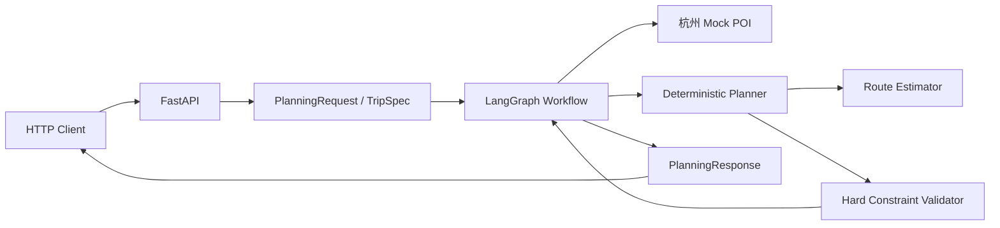

# 01. v0.1 实现总览

## 1. 这一版解决什么问题

v0.1 接收一份已经结构化的旅行需求，例如：

```text
目的地：杭州
旅行日期：2026-10-02 至 2026-10-04
到达：10 月 2 日 10:30，杭州东站
离开：10 月 4 日 19:00，杭州东站
预算：1500 元
兴趣：自然、美食、人文
必去：灵隐寺
每日步行上限：6000 米
每日活动时长上限：360 分钟
```

系统会：

1. 加载杭州 Mock POI。
2. 生成三种风格的候选行程。
3. 为每天安排 POI 和访问时间。
4. 估算地点之间的交通时间和步行量。
5. 检查预算、营业时间、到离站缓冲等约束。
6. 如果所有候选都不合法，则在限制次数内重新规划。
7. 从合法候选中选择评分最高的一份。
8. 通过 FastAPI 返回结构化 JSON。

## 2. 已经实现的功能

### 2.1 强类型旅行需求

`TripSpec` 包含：

- 目的地
- 开始和结束日期
- 旅行人数
- 到达地点、时间和坐标
- 离开地点、时间和坐标
- 住宿地点和坐标
- 总预算
- 兴趣和排斥项
- 必去地点
- 行程节奏
- 每日步行与活动时间上限
- 每日开始和结束时间

Pydantic 会在请求进入规划器之前检查类型和基础合法性。

### 2.2 杭州 Mock POI

当前包含西湖、灵隐寺、西溪湿地、河坊街、浙江省博物馆、中国茶叶博物馆、京杭大运河和杭州植物园等地点。

每个 POI 包含：

- 名称和唯一 ID
- 经纬度
- 类别
- 营业时间
- 建议游玩时长
- 预计费用
- 室内/室外属性
- 适老、雨天、夜游等标签
- 数据来源和置信度

### 2.3 三类候选方案

| 风格 | 初始每日活动上限 | 设计目标 |
|---|---:|---|
| relaxed | 2 | 活动更少、节奏更轻松 |
| balanced | 3 | 兴趣和行程密度平衡 |
| exploration | 4 | 尽量覆盖更多地点 |

这里的“活动上限”是候选选择阶段的上限。具体安排时如果某个 POI 超出营业时间或当日可用时间，Planner 还会跳过非必去地点。

### 2.4 确定性路线估算

v0.1 没有调用高德路线 API，而是：

1. 使用 Haversine 公式计算两个经纬度之间的球面直线距离。
2. 将直线距离乘以 `1.25`，近似为道路距离。
3. 假设平均道路速度约为 22 km/h，并增加固定缓冲。
4. 用道路距离的一部分估算步行距离。

这是一个可替换的临时实现。它的价值在于让 Planner 和 Validator 可以先工作，而不是追求真实交通精度。

### 2.5 硬约束验证

当前检查：

- 计划是否为空
- 必去地点是否被安排
- 同一天的活动是否重叠
- 第一天是否预留到达缓冲
- 最后一天是否预留返程缓冲
- 是否在 POI 营业时间内访问
- 每日步行量是否超出上限
- 每日活动时间是否超出上限
- 总预计费用是否超出预算

### 2.6 LangGraph Loop

当前 Graph 会根据验证结果路由：

```text
存在合法候选
→ select_best

不存在合法候选，但仍有重规划次数
→ replan

不存在合法候选，重规划次数耗尽
→ mark_infeasible
```

### 2.7 FastAPI 接口

当前接口：

```text
GET  /health
POST /api/v1/plans
```

`POST /api/v1/plans` 是同步接口：请求会等待整个 LangGraph 执行结束，再一次性返回结果。

### 2.8 自动化测试

当前测试覆盖：

- 旅行天数计算
- 到离站时间必须包含时区
- 正常旅行需求生成合法方案
- 必去景点费用超过预算时返回无解
- 健康检查接口
- 创建计划接口

### 2.9 链路日志

规划工作流已经加入分级日志：

- `INFO` 展示请求开始、节点进入与完成、候选验证摘要、路由决策、重规划和最终选择。
- `DEBUG` 进一步展示每天的候选行程摘要和具体违规。
- 每条关键日志携带 `thread_id`，可以把同一次请求跨节点的日志串联起来。

日志只输出观察流程所需的摘要，不打印完整 State、API Key 或体积较大的路线矩阵。完整说明见 [可观测性与链路日志](09-observability-and-logging.md)。

## 3. v0.1 的系统结构



## 4. v0.1 没有实现什么

下面这些出现在完整架构文档中，但还没有进入当前代码：

- 中文自然语言 Requirement Parser
- LLM High-level Planner
- LLM Critic
- 高德 POI 和路线 API
- 和风天气 API
- OR-Tools TSP/时间窗求解
- 用户澄清和 Human-in-the-loop
- PostgreSQL Checkpoint
- Redis 缓存
- 跨旅行长期偏好
- 计划版本和局部 Diff
- 真正的局部重规划
- LangSmith Benchmark

在学习和面试表达中，应明确区分“已经实现”和“设计规划”，避免把未来模块描述成现有功能。

## 5. 为什么第一版不立即接 LLM

如果一开始就加入 LLM、地图、天气、数据库和前端，任何错误都可能来自不同层，初学者很难定位。

v0.1 先验证以下基础假设：

- 领域数据能否被清晰建模
- 候选计划能否被程序生成
- 硬约束能否被确定性检查
- Replan Loop 能否正确停止
- API 和 Graph 能否连接
- 测试能否稳定复现结果

这些基础稳定之后，接入 LLM 才不会把系统变成不可测试的 Prompt 集合。

## 6. 怎样判断 v0.1 成功

v0.1 的成功标准不是“行程像真人攻略一样精彩”，而是：

- 示例请求可以稳定运行
- 同样输入得到可解释的确定性输出
- 已知约束违规不会被放行
- 无解时可以明确返回 `infeasible`
- Loop 有最大次数，不会无限执行
- 修改核心代码后可以通过测试发现回归
