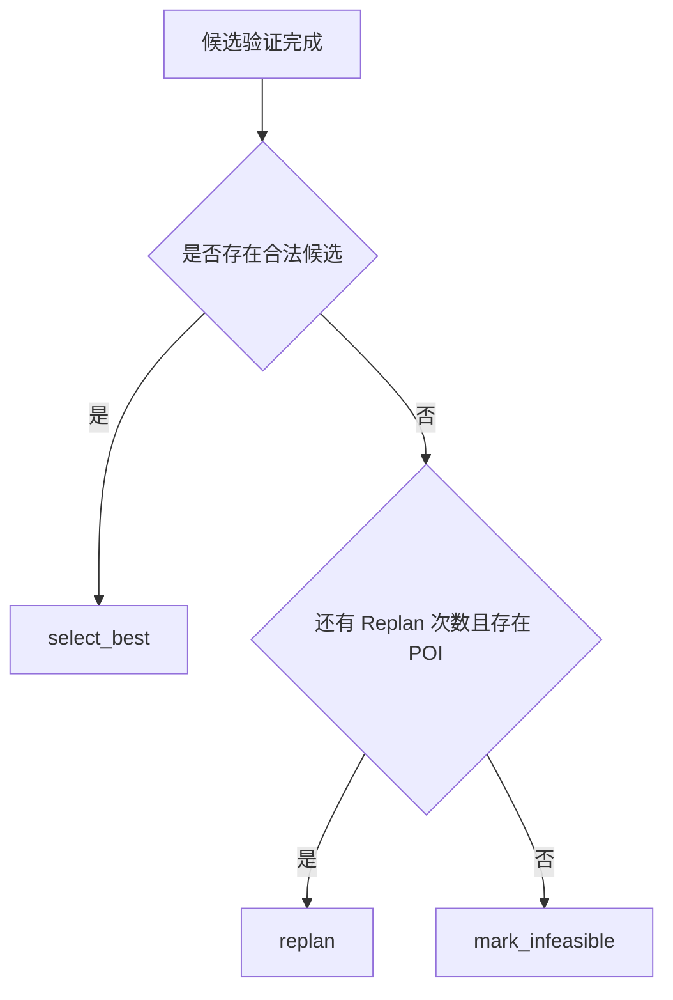

# 02. 一次请求的完整生命周期

本章使用 [`examples/hangzhou_request.json`](../../examples/hangzhou_request.json) 说明一条请求如何从 HTTP JSON 变成最终旅行计划。

## 1. 客户端发送 JSON

请求目标：

```text
POST /api/v1/plans
```

最外层数据结构是：

```json
{
  "trip": {
    "destination": "杭州",
    "start_date": "2026-10-02",
    "end_date": "2026-10-04"
  },
  "max_replan_rounds": 2
}
```

完整字段参见示例文件。

## 2. FastAPI 将 JSON 转成 PlanningRequest

路由函数位于：

```text
src/travel_agent/api/routes.py
```

核心形式：

```python
@router.post("/api/v1/plans", response_model=PlanningResponse)
def create_plan(request: PlanningRequest) -> PlanningResponse:
    return run_planning(request, thread_id=str(uuid4()))
```

FastAPI 根据类型标注自动完成：

1. 读取 HTTP JSON。
2. 使用 Pydantic 构造 `PlanningRequest`。
3. 递归构造其中的 `TripSpec`、`TransportAnchor` 等模型。
4. 执行字段和跨字段校验。
5. 校验失败时返回 HTTP 422。
6. 校验成功时调用 `run_planning`。

这一层解决的是“输入是否具有正确结构”，还没有判断旅行计划是否可执行。

## 3. 创建 LangGraph 初始 State

`run_planning` 创建：

```python
initial_state = {
    "trip": request.trip,
    "pois": [],
    "candidates": [],
    "selected_plan": None,
    "iterations": 0,
    "max_replan_rounds": request.max_replan_rounds,
    "status": "started",
    "message": None,
}
```

可以把 State 理解成一次规划任务的共享工作台。

初始时只有用户需求，POI 和候选计划都还为空。

## 4. 为本次运行分配 thread_id

```python
config={
    "configurable": {"thread_id": run_thread_id},
    "recursion_limit": 20,
}
```

`thread_id` 用于标识一条 LangGraph 执行线程。因为 Graph 使用了 Checkpointer，运行时需要知道状态属于哪条线程。

`recursion_limit` 是运行时兜底，避免图由于错误路由而无限循环。业务上还有 `max_replan_rounds`，两者作用不同：

```text
max_replan_rounds
→ 业务允许重新规划几次

recursion_limit
→ 整张图最多执行多少个步骤的安全上限
```

## 5. load_context：加载 POI

输入：

```text
state["trip"].destination
```

执行：

```python
pois = get_mock_pois(state["trip"].destination)
```

输出更新：

```python
{
    "pois": pois,
    "status": "context_loaded"
}
```

当前只支持杭州。如果输入其他城市，POI 为空，后续最终会进入 `infeasible`。

这里体现了 LangGraph 节点的基本规则：节点通常不修改传入对象，而是返回需要合并到 State 的字段。

## 6. create_initial_candidates：生成候选

节点调用：

```python
generate_candidates(trip, pois, replan_round=0)
```

它依次生成：

- relaxed
- balanced
- exploration

每种候选的主要步骤如下。

### 6.1 POI 偏好评分

POI 初始分为 `1.0`，然后根据以下条件调整：

- 类别或标签匹配兴趣：加分
- 类别或标签命中排斥项：减分
- 命中必去地点：大幅加分
- 需要频繁休息且 POI 适老：加分
- Replan 轮次增加时，收费较高 POI 被额外扣分

必去地点使用很大的奖励，是为了保证它优先进入候选池。最终是否真的成功安排，仍由 Validator 再次确认。

### 6.2 选择候选 POI

```text
每日风格上限 × 旅行天数
→ 得到最多选择多少个 POI
```

例如三天 relaxed 方案初始最多选择：

```text
2 × 3 = 6 个 POI
```

### 6.3 将 POI 分配到不同日期

当前使用简单的轮询分配：

```text
POI 1 → Day 1
POI 2 → Day 2
POI 3 → Day 3
POI 4 → Day 1
POI 5 → Day 2
POI 6 → Day 3
```

这不是最优算法，只是为了先形成可运行日程。未来会替换为地理聚类和时间窗优化。

### 6.4 单日最近邻排序

一天中的多个 POI 从住宿地或到达地点出发，每次选择距离当前地点最近的下一个 POI：

```text
当前位置
  ↓
从剩余地点中选择最近者
  ↓
更新当前位置
  ↓
继续选择
```

这是一种 Greedy Nearest Neighbor 启发式，不保证全局最优，但实现简单、执行快速。

### 6.5 构建具体时间表

每个活动的时间计算大致为：

```text
前一活动结束时间
+ 预计交通时间
= 到达 POI 的时间

活动开始时间
= max(到达时间, POI 开门时间)

活动结束时间
= 活动开始时间 + 建议游玩时长
```

第一天至少预留到达后的 60 分钟缓冲；最后一天至少预留出发前的 90 分钟缓冲。

如果非必去地点无法在关门或当日结束前完成，Planner 会跳过它。必去地点会被保留，让 Validator 明确报告冲突，而不是静默删除用户的硬要求。

### 6.6 计算指标与分数

候选指标包括：

- 兴趣匹配率
- 内容多样性
- 数据置信度
- 总交通时间
- 总步行距离
- 预计费用
- 疲劳度

评分用于在合法候选之间排序，不用于掩盖硬约束违规。

## 7. validate_candidates：检查所有候选

Graph 对三个候选逐一调用：

```python
validate_candidate(trip, candidate, pois)
```

Validator 返回：

```python
ValidationResult(
    valid=True或False,
    violations=[...],
)
```

然后通过 `model_copy(update=...)` 将验证结果写回候选计划。

## 8. 条件路由

`route_after_validation` 做三选一：



## 9. Replan

如果进入 Replan：

1. `iterations` 加一。
2. 每种风格的每日活动上限减少。
3. 收费较高的 POI 在排序中受到更高惩罚。
4. 重新生成三个候选。
5. 回到 `validate_candidates`。

注意：v0.1 的 Replan 是简化的全量候选重生成，还不是设计文档中的 affected-days 局部重规划。

## 10. select_best 或 mark_infeasible

如果存在合法候选：

```python
selected = max(valid_candidates, key=score)
```

状态变成：

```text
completed
```

如果达到最大重规划次数仍无合法方案：

```text
status = infeasible
selected_plan = null
```

## 11. 返回 HTTP Response

`run_planning` 将最终 State 转换成：

```python
PlanningResponse(
    status=...,
    selected_plan=...,
    candidates=...,
    iterations=...,
    message=...,
)
```

FastAPI 再把它序列化为 JSON 返回客户端。

## 12. 一条请求的数据流总结

```text
HTTP JSON
→ PlanningRequest
→ TripSpec
→ TravelState
→ Mock POI
→ 3 个 PlanCandidate
→ ValidationResult
→ 条件路由
→ 最佳 PlanCandidate 或 Infeasible
→ PlanningResponse JSON
```
