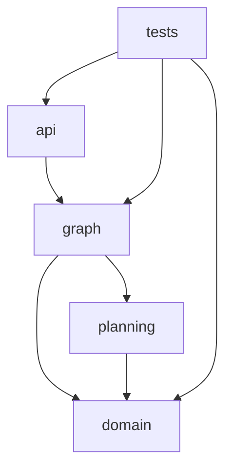

# 03. 代码结构逐层导读

## 1. 项目目录

```text
LearnAgent/
├── pyproject.toml
├── README.md
├── examples/
│   └── hangzhou_request.json
├── src/travel_agent/
│   ├── app.py
│   ├── logging_config.py
│   ├── api/
│   │   └── routes.py
│   ├── domain/
│   │   └── models.py
│   ├── graph/
│   │   ├── state.py
│   │   └── workflow.py
│   └── planning/
│       ├── mock_data.py
│       ├── planner.py
│       ├── routing.py
│       └── validator.py
└── tests/
    ├── conftest.py
    ├── test_api.py
    ├── test_domain_models.py
    ├── test_logging.py
    └── test_workflow.py
```

推荐按以下顺序阅读代码：

```text
models.py
→ mock_data.py
→ routing.py
→ planner.py
→ validator.py
→ state.py
→ workflow.py
→ routes.py
→ tests/
```

## 2. pyproject.toml：项目和依赖入口

`pyproject.toml` 定义：

- 包名和版本
- Python 最低版本
- 生产依赖
- 开发依赖
- `src` 包目录
- pytest 默认配置
- coverage 配置

核心依赖：

| 依赖 | 作用 |
|---|---|
| FastAPI | 提供 HTTP API 和 OpenAPI 文档 |
| Pydantic | 定义和校验结构化数据 |
| LangGraph | 编排有状态工作流和 Loop |
| Uvicorn | 运行 ASGI Web 服务 |
| pytest | 自动化测试 |
| httpx | API 测试客户端依赖 |
| pytest-cov | 统计测试覆盖率 |

使用 `src` 布局可以避免测试时意外从项目根目录导入未安装代码，更接近真实打包环境。

## 3. domain/models.py：业务语言的定义

这一文件不是普通的数据结构集合，而是项目的领域语言。

### 3.1 Enum

例如：

```python
class PlanStyle(StrEnum):
    RELAXED = "relaxed"
    BALANCED = "balanced"
    EXPLORATION = "exploration"
```

使用 Enum 的好处：

- 限制可选值
- 避免不同模块使用不同拼写
- 自动生成 OpenAPI 枚举说明
- IDE 可以补全

### 3.2 基础值对象

`Coordinate`：

```python
longitude: -180 到 180
latitude: -90 到 90
```

`TimeWindow`：

```python
start < end
```

`TransportAnchor`：

```text
地点名 + 时间 + 经纬度
```

时间必须带时区，避免把 `10:30` 错误理解成 UTC 或其他城市本地时间。

### 3.3 TripSpec

`TripSpec` 是规划系统最重要的输入模型。

它使用 `@model_validator(mode="after")` 检查多个字段之间的关系，例如：

```text
end_date >= start_date
departure > arrival
daily_end > daily_start
到达和离开时间落在旅行日期范围内
```

单个字段的范围可以用 `Field` 校验；需要同时读取多个字段时使用 model validator。

### 3.4 为什么费用使用 Decimal

金额使用：

```python
Decimal
```

而不是：

```python
float
```

因为二进制浮点数无法精确表达很多十进制金额。虽然 v0.1 金额计算很简单，提前使用 Decimal 能避免后续预算统计产生精度问题。

### 3.5 PlanCandidate

一个候选计划包含：

```text
id
style
days
metrics
validation
score
reason_facts
```

其中：

- `days` 是实际日程
- `metrics` 是可比较的量化指标
- `validation` 是是否合法
- `score` 只用于合法候选之间排序
- `reason_facts` 是后续生成自然语言解释的数据依据

### 3.6 输入和输出模型

```text
PlanningRequest
→ API 接收的请求

PlanningResponse
→ API 返回的响应
```

将 API 模型与内部 State 区分，可以避免把执行中间数据全部暴露给调用方。

## 4. planning/mock_data.py：开发期数据源

这里定义杭州 POI Fixture。

为什么使用 Mock：

- 不需要 API Key
- 测试结果稳定
- 不受网络和限流影响
- 可以故意构造边界条件
- 适合先调试 Planner 和 Validator

`get_mock_pois` 返回深拷贝，避免某次运行修改对象后污染后续测试。

当前只支持杭州：

```python
if normalized != "杭州":
    return []
```

这是一条明确的 v0.1 产品边界，不是隐藏错误。

## 5. planning/routing.py：路线估算适配点

### 5.1 Haversine

`haversine_distance_meters` 根据两个经纬度计算球面直线距离。

它考虑地球曲率，比直接计算经纬度差更合理，但仍不是道路路线。

### 5.2 estimate_route

返回三个值：

```python
(road_distance, travel_minutes, walking_meters)
```

当前是经验估算：

```text
道路距离 = 直线距离 × 1.25
交通时间 = 道路距离 ÷ 22 km/h + 固定缓冲
步行距离 = 道路距离的一部分，并设置上限
```

函数被单独放在文件中，是为了未来用高德实现替换，而不需要修改 Planner 的业务接口。

## 6. planning/planner.py：候选计划生成

### 6.1 STYLE_ACTIVITY_LIMITS

定义不同风格的初始每日活动数量：

```python
relaxed: 2
balanced: 3
exploration: 4
```

### 6.2 _poi_preference_score

负责计算一个 POI 对当前用户的适配程度。

这是一个手工规则评分器。未来可以加入：

- Embedding 相似度
- 用户长期画像
- LLM rerank
- 热度、拥挤和天气特征

但硬性的必去优先和排斥规则仍应由代码保留。

### 6.3 _select_pois

对 POI 排序并截取当前风格允许的数量。

Replan 轮次增加时：

- 每日活动数减少
- 高费用地点的排序下降

### 6.4 _order_nearest

使用最近邻贪心排序。

时间复杂度大约是 `O(n²)`，但 v0.1 POI 数量很小，完全足够。

### 6.5 _schedule_day

负责：

- 计算当天可用时间窗
- 设置首日到达缓冲
- 设置末日返程缓冲
- 估算地点间交通
- 等待 POI 开门
- 安排活动开始和结束时间
- 跳过放不下的非必去地点
- 汇总费用、交通、步行和疲劳度

这是 Planner 中业务规则最集中的函数。

### 6.6 _build_candidate

将选中的 POI 分配到各天，构建 DayPlan，最后计算 PlanMetrics 和综合分数。

### 6.7 generate_candidates

这是外部使用的公开函数：

```python
generate_candidates(trip, pois, replan_round=0)
```

其他下划线开头的函数是模块内部实现细节。

## 7. planning/validator.py：合法性门禁

`validate_candidate` 不尝试改计划，只负责报告事实：

```text
输入：TripSpec + PlanCandidate + POI
输出：ValidationResult
```

这种设计叫做职责分离：

```text
Planner 负责提出方案
Validator 负责判断方案是否合法
Graph 负责决定是否合法后去哪里
```

如果 Validator 同时生成和修复计划，很容易把规则混在一起，难以测试。

## 8. graph/state.py：运行时共享状态

`TravelState` 是 TypedDict：

```text
trip
pois
candidates
selected_plan
iterations
max_replan_rounds
status
message
```

Pydantic Model 和 TypedDict 的区别：

```text
Pydantic Model
→ 运行时解析和校验业务数据

TypedDict
→ 为 Graph State 提供静态类型提示和字段说明
```

## 9. graph/workflow.py：编排控制中心

文件分为三类内容：

1. Node 函数
2. 条件路由函数
3. Graph 构建与调用入口

Node 包括：

```text
load_context
create_initial_candidates
validate_candidates
replan
select_best
mark_infeasible
```

`build_workflow` 把它们连接起来，`run_planning` 则负责初始化 State 并调用 Graph。

## 10. api/routes.py 与 app.py

`app.py` 创建 FastAPI 应用；`routes.py` 定义具体接口。

这样拆分后，未来可以增加：

```text
trips.py
plans.py
runs.py
events.py
feedback.py
```

而不让 `app.py` 变成一个巨大的文件。

### logging_config.py

集中配置 Python 标准库 `logging`。它从 `APP_LOG_LEVEL` 读取日志级别，默认使用 `INFO`；未知值会安全回退为 `INFO`。工作流使用模块级 Logger 记录事件，避免散落的 `print` 无法筛选级别或关联请求。

## 11. tests：可执行的行为说明

测试不仅是检查错误，也是最可靠的使用示例。

### conftest.py

定义复用的 `hangzhou_trip` Fixture。

### test_domain_models.py

验证领域模型规则。

### test_workflow.py

验证正常计划和无解场景。

### test_api.py

从 HTTP 接口层验证整个调用链。

### test_logging.py

验证日志级别配置、正常规划流、DEBUG 候选日程摘要以及 Replan 到无解的完整日志流。

## 12. 模块依赖方向



`domain` 不依赖 FastAPI 或 LangGraph。这意味着核心业务模型可以脱离 Web 框架使用，是一个健康的依赖方向。
