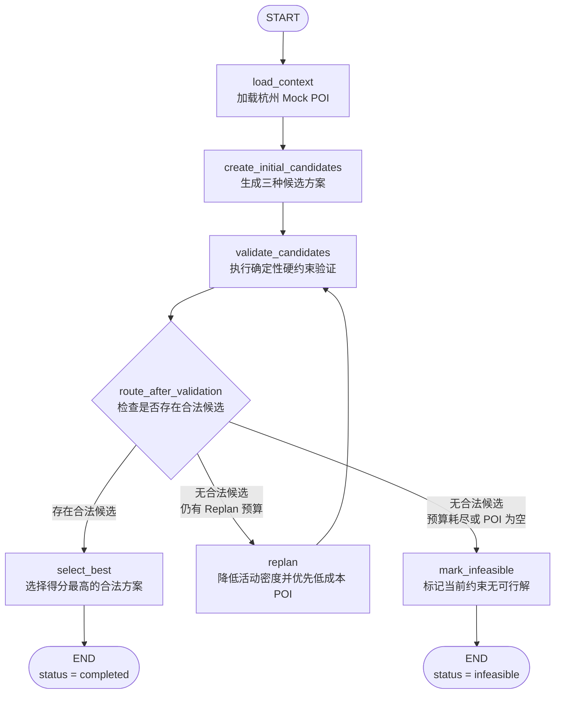
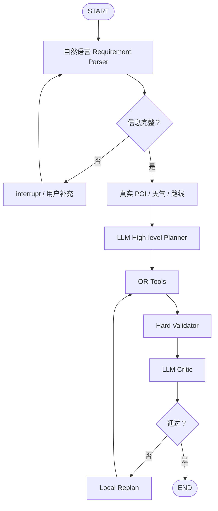

# 04. LangGraph 在项目中如何工作

## 1. 为什么需要 LangGraph

普通函数当然也能完成 v0.1 的流程，但项目后续需要：

- 条件分支
- Replan Loop
- Checkpoint
- Human-in-the-loop
- 长任务暂停和恢复
- 节点级追踪
- 局部重规划

LangGraph 将这些控制逻辑显式表示成图，为后续演进保留了正确的结构。

## 2. v0.1 当前节点图

下面这张图与 `src/travel_agent/graph/workflow.py` 中的当前代码一一对应，不包含尚未实现的 LLM、真实地图、天气或 Human-in-the-loop 节点。



### 2.1 节点与 State 更新

| 节点 | 主要读取 | 主要更新 | 是否可能调用下一轮 Loop |
|---|---|---|---|
| `load_context` | `trip.destination` | `pois`、`status`、`message` | 否 |
| `create_initial_candidates` | `trip`、`pois`、`iterations` | `candidates`、`status` | 否 |
| `validate_candidates` | `trip`、`pois`、`candidates` | 带验证结果的 `candidates`、`status` | 通过条件边决定 |
| `replan` | `trip`、`pois`、`iterations` | 新候选、`iterations`、`status`、`message` | 是，回到验证节点 |
| `select_best` | 已验证的 `candidates` | `selected_plan`、`status`、`message` | 否 |
| `mark_infeasible` | 当前执行状态 | `selected_plan=None`、`status`、`message` | 否 |

`route_after_validation` 是条件路由函数，不是业务处理节点。它不生成新数据，只读取 State 并返回下一节点的名称。

### 2.2 正常成功路径

初始候选中至少有一个合法方案时：

```text
START
→ load_context
→ create_initial_candidates
→ validate_candidates
→ select_best
→ END（completed）
```

### 2.3 触发一次 Replan 后成功

初始三个候选都不合法，但降低活动密度后出现合法方案时：

```text
START
→ load_context
→ create_initial_candidates
→ validate_candidates
→ replan
→ validate_candidates
→ select_best
→ END（completed）
```

### 2.4 达到上限后仍然无解

例如必去地点本身费用已经超过总预算：

```text
START
→ load_context
→ create_initial_candidates
→ validate_candidates
→ replan
→ validate_candidates
→ mark_infeasible
→ END（infeasible）
```

图中只有 `replan → validate_candidates` 是回边，它与条件路由共同构成当前 v0.1 的 Loop。

## 3. State、Node 和 Edge

### State

State 是节点共享的数据：

```python
class TravelState(TypedDict):
    trip: TripSpec
    pois: list[POI]
    candidates: list[PlanCandidate]
    selected_plan: PlanCandidate | None
    iterations: int
    max_replan_rounds: int
    status: str
    message: str | None
```

### Node

Node 是接收 State 并返回状态更新的函数：

```python
def load_context(state: TravelState) -> dict:
    pois = get_mock_pois(state["trip"].destination)
    return {"pois": pois, "status": "context_loaded"}
```

返回值只包含需要更新的字段，LangGraph 负责合并。

### Edge

固定边表示无条件执行顺序：

```python
builder.add_edge(START, "load_context")
builder.add_edge("load_context", "create_initial_candidates")
```

## 4. 条件边

验证完成后，下一步不是固定的：

```python
builder.add_conditional_edges(
    "validate_candidates",
    route_after_validation,
)
```

路由函数返回节点名：

```python
if 存在合法候选:
    return "select_best"
if 还有重规划预算:
    return "replan"
return "mark_infeasible"
```

路由函数应该尽量保持简单，不在里面调用外部 API 或执行昂贵操作。

## 5. Loop 是怎样形成的

下面这条边形成回路：

```python
builder.add_edge("replan", "validate_candidates")
```

执行路径可能是：

```text
validate_candidates
  ↓ 没有合法方案
replan
  ↓
validate_candidates
  ↓ 仍然没有合法方案
replan
  ↓
validate_candidates
  ↓ 达到上限
mark_infeasible
```

它与普通 Python 的关系近似：

```python
while not valid and iterations < max_replan_rounds:
    candidates = replan(candidates)
    valid = validate(candidates)
```

区别在于 LangGraph 把循环拆成可观察、可持久化的节点和边。

## 6. 两层防死循环

### 业务层上限

```text
max_replan_rounds
```

由用户请求传入，范围限制为 0 到 5。

### 运行时上限

```text
recursion_limit = 20
```

它限制整张图允许执行的步骤数量，是防止错误图结构的最后保护。

即使未来有人错误添加了回边，Graph 也不会永远运行。

## 7. Checkpoint

编译 Graph 时使用：

```python
builder.compile(checkpointer=InMemorySaver())
```

这使每一步的 State 可以按 `thread_id` 保存。

当前限制：

- 只保存在 Python 进程内存中
- 服务重启后丢失
- 不适合多实例服务
- 当前 API 还没有暴露恢复接口

因此 v0.1 只是具备 Checkpoint 基础结构，还没有完成真正的 durable execution。

未来会替换成 PostgreSQL Checkpointer：

```text
InMemorySaver
→ PostgresSaver
```

Graph 节点本身不需要因为存储变化而重写。

## 8. thread_id

每个 API 请求生成新的 UUID：

```python
thread_id = str(uuid4())
```

它表示一条独立的执行线程。

未来实现多轮修改时，同一旅行计划的后续操作可以复用 thread ID，从原 Checkpoint 继续。

不要把 `thread_id` 与数据库 `trip_id` 混为一谈：

```text
trip_id
→ 业务中的旅行实体

thread_id
→ LangGraph 执行上下文标识
```

两者未来可以建立关联，但语义不同。

## 9. Graph 的入口和出口

入口：

```python
builder.add_edge(START, "load_context")
```

出口：

```python
builder.add_edge("select_best", END)
builder.add_edge("mark_infeasible", END)
```

因此一次运行有两个正常终态：

```text
completed
infeasible
```

`infeasible` 不是程序异常，而是业务上没有找到满足当前约束的方案。

## 10. v0.1 是 ReAct 吗

不是。

ReAct 通常是：

```text
模型推理
→ 选择工具
→ 观察结果
→ 再推理
```

v0.1 是显式的：

```text
Plan
→ Validate
→ Replan
```

目前甚至没有 LLM，因此也没有 Thought/Action/Observation 循环。

未来可以在 POI 搜索子图中使用有界 Tool Calling/ReAct，但顶层仍保持显式的 Plan–Execute–Validate–Replan 控制。

## 11. v0.1 有上下文管理吗

有基础上下文管理，主要是：

### 结构化请求上下文

`TripSpec` 保存用户旅行约束。

### 运行时上下文

`TravelState` 保存 POI、候选、迭代次数和执行状态。

### Checkpoint 上下文

`InMemorySaver` 按 thread ID 保存图状态。

但下面这些还没有实现：

- 原始对话上下文
- 消息摘要和裁剪
- 跨旅行长期用户偏好
- 外部数据引用和大型上下文卸载
- 每个 LLM 节点的 Context Projection

因此更准确的说法是：

> v0.1 已经实现结构化运行状态和内存 Checkpoint，但尚未实现完整的 LLM 上下文管理系统。

## 12. 怎样观察 Graph

当前版本已经在工作流中加入链路日志。使用 `INFO` 可以观察：

```text
planning.started
node.started / node.completed
candidate.generated / candidate.validated
routing.decision
replan.started / replan.completed
plan.selected 或 planning.infeasible
planning.completed
```

关键事件都包含 `thread_id`。切换到 `DEBUG` 后，还能看到每天的候选行程摘要和具体违规。日志不会打印整个 State，因为后续路线矩阵和 POI 数据会很大，也可能包含敏感信息。

运行方式、字段含义和完整事件目录见 [可观测性与链路日志](09-observability-and-logging.md)。

## 13. 未来扩展位置



v0.1 的价值在于图的骨架已经存在，后续扩展是增加或替换节点，而不是推倒重写。
