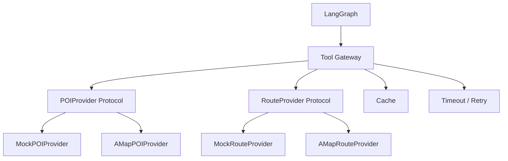

# 07. 从 v0.1 到 v0.2 的路线

## 1. v0.2 建议目标

v0.2 不建议立即加入所有完整设计。最合理的单一目标是：

> 建立可替换的 Tool Provider 层，并接入高德真实 POI 与路线数据，同时保留 Mock Provider 用于测试。

这样能够把项目从“固定测试数据规划器”升级成“能访问真实世界数据的 Agent 工具执行层”。

## 2. 为什么先做 Provider，而不是先接 LLM

当前 API 已经可以接收结构化需求。最明显的真实性缺口是：

- POI 是固定的
- 距离和时间是估算的
- 只支持杭州

如果先接 LLM，模型能把中文转成 TripSpec，但后续仍使用不真实数据。先完成 Provider 抽象，可以同时学习：

- 外部 API 集成
- 协议和适配器设计
- 异步 HTTP
- Schema 标准化
- 缓存与重试
- Mock 与真实实现切换
- Contract Test

## 3. v0.2 目标架构



## 4. 建议实施步骤

### Step 1：定义 Provider Protocol

只定义领域需要的能力，不直接把高德原始字段传播进业务层。

示例：

```python
class POIProvider(Protocol):
    async def search_pois(
        self,
        city: str,
        keywords: list[str],
    ) -> list[POI]: ...


class RouteProvider(Protocol):
    async def get_route(
        self,
        origin: Coordinate,
        destination: Coordinate,
    ) -> RouteResult: ...
```

### Step 2：将当前实现包装为 Mock Provider

保持现有测试不变或只做最小调整。

这是重构的安全网：如果抽象后 Mock 测试仍通过，说明没有破坏现有业务行为。

### Step 3：增加统一 ToolResult

```text
success
data
provider
fetched_at
expires_at
cache_hit
fallback_used
error
```

### Step 4：实现高德 Client

需要处理：

- API Key
- 请求参数
- HTTP Timeout
- 非 200 响应
- 高德业务状态码
- 空结果
- 字段缺失
- 坐标和单位
- 日志脱敏

### Step 5：实现缓存和重试

开发期可以先用内存 TTL Cache，后续再切 Redis。

只对可恢复错误重试，例如网络超时和部分服务端错误；参数错误不应盲目重试。

### Step 6：增加 Contract Test

保存脱敏后的高德响应 Fixture，测试：

- 正常 POI 响应
- 空结果
- 限流
- 错误状态码
- 缺失字段

测试不能每次都依赖真实网络，否则会慢、不稳定并消耗配额。

### Step 7：将 Graph 改成异步

真实 HTTP 调用适合使用 `async`：

```text
workflow.invoke
→ workflow.ainvoke

同步 FastAPI 路由
→ async 路由
```

## 5. v0.2 验收标准

- Mock Provider 和 AMap Provider 实现同一 Protocol
- 未配置 API Key 时仍可运行 Mock 模式
- 高德原始响应不会直接进入 Planner
- 外部请求有 Timeout
- 可恢复错误有有限重试
- API Key 不出现在日志和响应中
- Contract Test 不依赖实时网络
- v0.1 原有测试继续通过
- 新增真实 Provider 的单元和契约测试

## 6. v0.2 暂时不做

为了控制学习范围，建议 v0.2 暂不加入：

- LLM 自然语言解析
- OR-Tools
- PostgreSQL Checkpoint
- 前端地图
- MCP Server
- 多 Agent

这些能力会在 Provider 层稳定之后逐步加入。

## 7. 后续版本建议

```text
v0.1
→ 确定性 Graph、候选生成、Validator、基础测试

v0.2
→ Provider 抽象、高德 POI/路线、可靠工具层

v0.3
→ LLM Requirement Parser、结构化输出、澄清问题

v0.4
→ OR-Tools、时间窗、候选优化

v0.5
→ PostgreSQL Checkpoint、Interrupt/Resume、计划版本

v0.6
→ affected-days 局部重规划、用户锁定和 Diff

v0.7
→ Benchmark、LangSmith、消融实验和成本评测
```

版本号只是学习路线建议，可以根据实际进度调整。关键原则是每个版本都保持：

```text
可运行
可测试
边界明确
有对应文档
```

